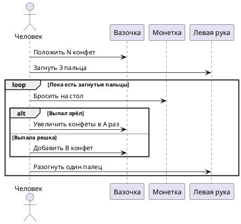
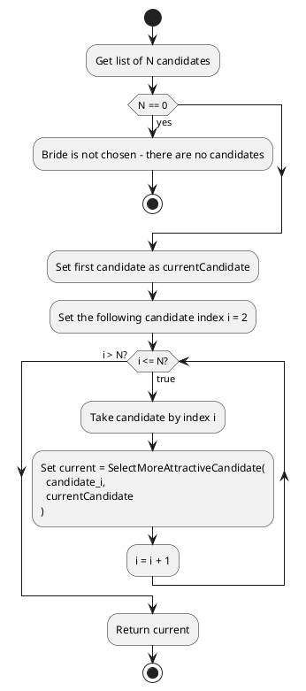
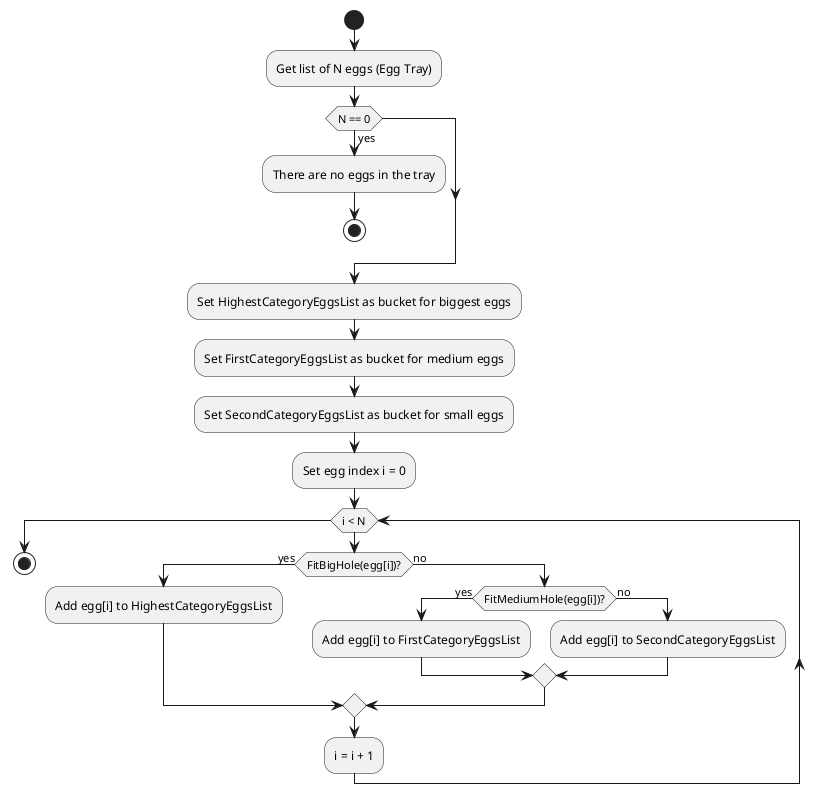

### Пример 1

1. Положить в вазочку N конфет. 
2. Загнуть на левой руке 3 пальца. 
3. Бросить монетку на стол. 
4. Если выпал орёл, увеличить количество конфет в вазочке в А раз, иначе добавить в вазочку В конфет. 
5. Разогнуть один палец на левой руке. 
6. Если на левой руке остались загнутые пальцы, перейти к п.3.



### Пример 2

Вы принц. И для выбора наиболее подходящей невесты вы организовали смотр кандидаток. Придумайте и опишите в виде блок-схемы алгоритм для решения этой задачи. 
- На вход подается N кандидаток. 
- Необходимо выбрать одну - самую красивую. 
- Операция сравнения красоты двух претенденток задана функцией `SelectMoreAttractiveCandidate(candidate_x, candidate_y)`.



### Пример 3
Создать UML для алгоритма сортировки яиц

Дано: 
- две калибровочных лунки (маленькая и большая), 
- лоток с яйцами

Надо разделить яйца на высшую, первую и вторую категории 
Псевдокод алгоритма:
```
Нач 
	Пока в лотке есть яйца 
Нц 
	Взять яйцо из лотка 
	Опустить в большую лунку 
	Если яйцо не пролезает То Положить яйцо в корзину для высшей категории Иначе Опустить яйцо в маленькую лунку 
		Если яйцо не пролезает То Положить яйцо в корзину для первой категории 
		Иначе Положить яйцо в корзину для второй категории 
		Всё 
	Всё 
Кц 
Кон
```

UML:


