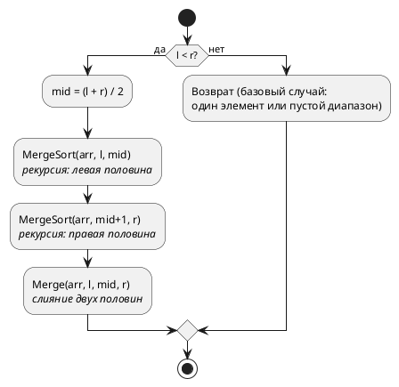

### 3.1 Принцип работы
 
Merge Sort использует стратегию **«разделяй и властвуй»** (divide and conquer):
 
1. **Разделение:** Массив рекурсивно делится пополам до тех пор, пока каждая часть не будет содержать один элемент (массив из одного элемента считается отсортированным).
2. **Слияние (merge):** Два отсортированных подмассива объединяются в один отсортированный массив. Для этого поочерёдно сравниваются первые элементы обоих подмассивов — меньший записывается в результат, его указатель сдвигается вперёд.
3. Процесс слияния поднимается вверх по рекурсии, пока весь массив не будет собран воедино.
 
Пример для `[38, 27, 43, 3]`:
 
```
Разделение:     [38, 27, 43, 3]
               /                \
          [38, 27]            [43, 3]
          /      \            /      \
        [38]    [27]        [43]    [3]
 
Слияние:  [38]    [27]        [43]    [3]
          \      /            \      /
          [27, 38]            [3, 43]
               \                /
            [3, 27, 38, 43]
```
 
### 3.2 Блок-схема
 
**MergeSort(arr, l, r):**
 

 
**Merge(arr, l, mid, r):**
 
```plantuml
@startuml
start
 
:Скопировать arr[l..mid] в L[]
Скопировать arr[mid+1..r] в R[];
 
:i = 0, j = 0, k = l;
 
while (i < |L| И j < |R|?) is (да)
  if (L[i] <= R[j]?) then (да)
    :arr[k] = L[i]
    i++;
  else (нет)
    :arr[k] = R[j]
    j++;
  endif
  :k++;
endwhile (нет)
 
:Дописать оставшиеся
элементы из L[] или R[]
в arr[k..r];
 
stop
@enduml
```
 
### 3.3 Реализация на C#
 
```csharp
public static void MergeSort(int[] arr, int left, int right)
{
    if (left >= right)
        return; // Базовый случай: один элемент или пустой диапазон
 
    int mid = left + (right - left) / 2; // Защита от переполнения
 
    MergeSort(arr, left, mid);       // Сортируем левую половину
    MergeSort(arr, mid + 1, right);  // Сортируем правую половину
    Merge(arr, left, mid, right);    // Сливаем два отсортированных фрагмента
}
 
private static void Merge(int[] arr, int left, int mid, int right)
{
    // Создаём временные массивы для левой и правой частей
    int leftLen = mid - left + 1;
    int rightLen = right - mid;
 
    int[] leftArr = new int[leftLen];
    int[] rightArr = new int[rightLen];
 
    // Копируем данные во временные массивы
    Array.Copy(arr, left, leftArr, 0, leftLen);
    Array.Copy(arr, mid + 1, rightArr, 0, rightLen);
 
    int i = 0; // Указатель для leftArr
    int j = 0; // Указатель для rightArr
    int k = left; // Указатель для записи в основной массив
 
    // Слияние: берём меньший из двух текущих элементов
    while (i < leftLen && j < rightLen)
    {
        if (leftArr[i] <= rightArr[j]) // <= обеспечивает устойчивость
        {
            arr[k] = leftArr[i];
            i++;
        }
        else
        {
            arr[k] = rightArr[j];
            j++;
        }
        k++;
    }
 
    // Дописываем оставшиеся элементы (только один из циклов сработает)
    while (i < leftLen)
    {
        arr[k] = leftArr[i];
        i++;
        k++;
    }
 
    while (j < rightLen)
    {
        arr[k] = rightArr[j];
        j++;
        k++;
    }
}
 
// Удобная обёртка для вызова
public static void MergeSort(int[] arr)
{
    MergeSort(arr, 0, arr.Length - 1);
}
```
 
### 3.4 Анализ сложности
 
| Случай           | Временная сложность | Пояснение                                          |
|------------------|--------------------|----------------------------------------------------|
| **Лучший**       | O(n log n)         | Всегда делит и сливает одинаково                    |
| **Средний**      | O(n log n)         | Не зависит от порядка элементов                     |
| **Худший**       | O(n log n)         | Гарантированная сложность — нет «плохих» входов     |
 
**Пространственная сложность:** O(n) — требуется дополнительная память для временных массивов при слиянии.
 
**Устойчивость:** Да — при условии `<=` в операции сравнения при слиянии.
 
### 3.5 Область применения
 
- **Гарантированная производительность:** Когда недопустимы «провалы» до O(n²), Merge Sort — безопасный выбор. Сложность всегда O(n log n).
- **Сортировка связанных списков:** Merge Sort — оптимальный алгоритм для связанных списков, так как слияние не требует произвольного доступа по индексу, а разделение пополам делается за O(n) через быстрый/медленный указатели. Дополнительная память — O(log n) на стек рекурсии (сами узлы переиспользуются).
- **Внешняя сортировка (external sort):** Когда данные не помещаются в оперативную память (например, файлы по несколько гигабайт), используется многофазное слияние на основе Merge Sort.
- **Когда важна устойчивость:** Один из немногих O(n log n) алгоритмов, который является устойчивым.
- **Параллельная обработка:** Левую и правую половины можно сортировать параллельно на разных ядрах/потоках.
 