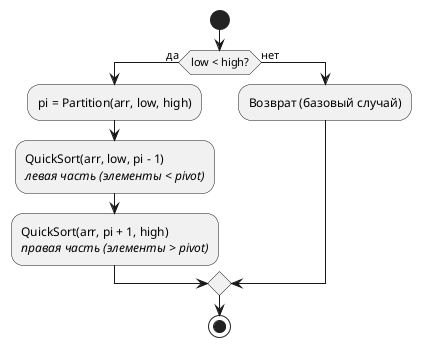

### 4.1 Принцип работы
 
Quick Sort также использует стратегию «разделяй и властвуй», но подходит к ней иначе, чем Merge Sort:
 
1. **Выбор опорного элемента (pivot):** Выбирается элемент массива — в данной реализации последний.
2. **Разделение (partition):** Массив перестраивается так, что все элементы **меньше** pivot оказываются слева от него, а все **большие или равные** — справа. После этого pivot стоит на своей **финальной позиции**.
3. **Рекурсия:** Процесс повторяется для левой и правой частей (без самого pivot — он уже на месте).
 
Детали работы `Partition` (схема Ломуто):
 
4. Выбираем `pivot = arr[high]`.
5. Заводим указатель `i = low - 1` — он отслеживает границу «малых» элементов.
6. Проходим индексом `j` от `low` до `high - 1`.
7. Если `arr[j] < pivot` — увеличиваем `i` и меняем местами `arr[i]` и `arr[j]` (перемещаем малый элемент в левую зону).
8. В конце ставим pivot на позицию `i + 1` — это его финальное место.
 
### 4.2 Блок-схема
 
**QuickSort(arr, low, high):**
 

 
**Partition(arr, low, high):**
 
```plantuml
@startuml
start
 
:pivot = arr[high]
i = low - 1
j = low;
 
while (j < high?) is (да)
  if (arr[j] < pivot?) then (да)
    :i = i + 1;
    :Обменять arr[i] и arr[j];
  endif
  :j = j + 1;
endwhile (нет)
 
:Обменять arr[i+1] и arr[high]
(поставить pivot на финальную позицию);
 
:Вернуть i + 1
(индекс pivot);
 
stop
@enduml
```
 
### 4.3 Реализация на C\#
 
```csharp
public static void QuickSort(int[] arr, int low, int high)
{
    if (low < high)
    {
        // Partition возвращает индекс опорного элемента на его финальной позиции
        int pivotIndex = Partition(arr, low, high);
 
        QuickSort(arr, low, pivotIndex - 1);   // Сортируем левую часть
        QuickSort(arr, pivotIndex + 1, high);   // Сортируем правую часть
    }
}
 
private static int Partition(int[] arr, int low, int high)
{
    int pivot = arr[high]; // Опорный элемент — последний в диапазоне
    int i = low - 1;       // Граница зоны элементов, меньших pivot
 
    for (int j = low; j < high; j++)
    {
        // Если текущий элемент меньше опорного —
        // перемещаем его в левую (малую) зону
        if (arr[j] < pivot)
        {
            i++;
            (arr[i], arr[j]) = (arr[j], arr[i]); // Обмен
        }
    }
 
    // Ставим pivot сразу после зоны малых элементов —
    // это его финальная позиция
    (arr[i + 1], arr[high]) = (arr[high], arr[i + 1]);
 
    return i + 1; // Возвращаем индекс pivot
}
 
// Удобная обёртка
public static void QuickSort(int[] arr)
{
    QuickSort(arr, 0, arr.Length - 1);
}
```
 
### 4.4 Анализ сложности
 
| Случай           | Временная сложность | Пояснение                                          |
|------------------|--------------------|----------------------------------------------------|
| **Лучший**       | O(n log n)         | Pivot каждый раз делит массив примерно пополам      |
| **Средний**      | O(n log n)         | Статистически вероятное разделение                   |
| **Худший**       | O(n²)              | Pivot — всегда минимум или максимум (уже отсортированный массив) |
 
**Пространственная сложность:** O(log n) в среднем (стек рекурсии). В худшем случае — O(n).
 
**Устойчивость:** Нет — элементы с равными значениями могут менять относительный порядок при разделении.
 
### 4.5 Область применения
 
- **Универсальная сортировка общего назначения:** На практике Quick Sort — один из самых быстрых алгоритмов благодаря отличной работе с кэшем процессора (последовательный доступ к памяти, малая константа).
- **Ограниченная память:** В отличие от Merge Sort, не требует O(n) дополнительной памяти — работает in-place.
- **Массивы (не связанные списки):** Эффективен для структур с произвольным доступом по индексу.
- **С оптимизациями:** На практике используется с рандомизированным выбором pivot (защита от O(n²)), медианой трёх, и переключением на Insertion Sort для мелких подмассивов. Именно так работает `Array.Sort()` в .NET (Introsort = Quick Sort + Heap Sort + Insertion Sort).
- **Не рекомендуется** для данных, где нужна устойчивость, или когда массив может быть уже отсортирован (без рандомизации pivot).
 