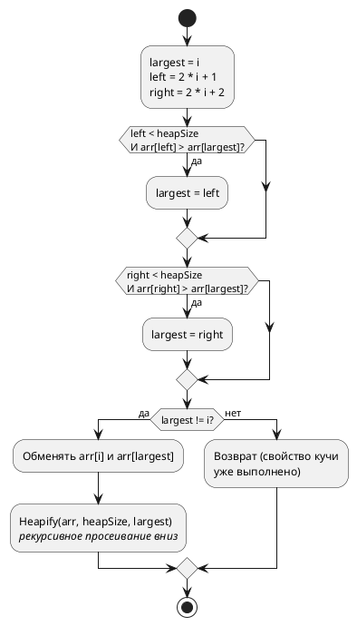

### 5.1 Принцип работы
 
Heap Sort основан на структуре данных **двоичная куча** (binary heap). Алгоритм работает в два этапа:
 
#### **Этап 1 — Построение max-heap (кучи с максимумом в корне):**
 
Двоичная куча хранится прямо в массиве. Для элемента с индексом `i`:
- Левый потомок: `2*i + 1`
- Правый потомок: `2*i + 2`
- Родитель: `(i - 1) / 2`
 
Свойство max-heap: каждый родитель ≥ обоих потомков. Это значит, что максимальный элемент всегда находится в корне (`arr[0]`).
 
Построение: вызываем операцию `Heapify` для каждого нелистового узла снизу вверх (от `n/2 - 1` до `0`).
 
#### **Этап 2 — Извлечение элементов:**
 
1. Максимальный элемент (`arr[0]`) меняется местами с последним элементом массива.
2. Размер кучи уменьшается на 1 (последний элемент — на своём месте).
3. Вызывается `Heapify` для корня, чтобы восстановить свойство кучи.
4. Повторяем, пока куча не опустеет.
 
#### **Операция Heapify (просеивание вниз):**
 
1. Сравнить узел с его потомками.
2. Если один из потомков больше — поменять узел с наибольшим потомком.
3. Продолжить просеивание вниз от позиции, куда был перемещён узел.
 
### 5.2 Блок-схема
 
**HeapSort(arr):**
 
```plantuml
@startuml
start
 
:n = длина массива;
 
note right
  **Этап 1: Построить max-heap**
  Обрабатываем нелистовые узлы
  снизу вверх
end note
 
:i = n/2 - 1;
while (i >= 0?) is (да)
  :Heapify(arr, n, i);
  :i = i - 1;
endwhile (нет)
 
note right
  **Этап 2: Извлечение максимумов**
  По одному перемещаем корень
  (максимум) в конец
end note
 
:i = n - 1;
while (i > 0?) is (да)
  :Обменять arr[0] и arr[i]
  //(максимум -> конец)//;
  :Heapify(arr, i, 0)
  //(восстановить кучу
  для уменьшенного размера)//;
  :i = i - 1;
endwhile (нет)
 
stop
@enduml
```
 
**Heapify(arr, heapSize, i):**
 

 
### 5.3 Реализация на C\#
 
```csharp
public static void HeapSort(int[] arr)
{
    int n = arr.Length;
 
    // Этап 1: Построение max-heap.
    // Начинаем с последнего нелистового узла и двигаемся к корню.
    // Листья (индексы n/2 .. n-1) уже удовлетворяют свойству кучи.
    for (int i = n / 2 - 1; i >= 0; i--)
    {
        Heapify(arr, n, i);
    }
 
    // Этап 2: По одному извлекаем максимум из кучи.
    for (int i = n - 1; i > 0; i--)
    {
        // Перемещаем текущий максимум (корень) в конец
        (arr[0], arr[i]) = (arr[i], arr[0]);
 
        // Восстанавливаем свойство кучи для уменьшенного массива
        // (i — новый размер кучи, последние элементы уже отсортированы)
        Heapify(arr, i, 0);
    }
}
 
/// <summary>
/// Просеивание вниз: восстанавливает свойство max-heap
/// для поддерева с корнем в позиции i.
/// </summary>
/// <param name="arr">Массив</param>
/// <param name="heapSize">Текущий размер кучи (не всего массива!)</param>
/// <param name="i">Индекс корня поддерева</param>
private static void Heapify(int[] arr, int heapSize, int i)
{
    int largest = i;          // Предполагаем, что корень — наибольший
    int left = 2 * i + 1;    // Левый потомок
    int right = 2 * i + 2;   // Правый потомок
 
    // Если левый потомок существует и больше текущего наибольшего
    if (left < heapSize && arr[left] > arr[largest])
        largest = left;
 
    // Если правый потомок существует и больше текущего наибольшего
    if (right < heapSize && arr[right] > arr[largest])
        largest = right;
 
    // Если наибольший — не корень, нужен обмен и дальнейшее просеивание
    if (largest != i)
    {
        (arr[i], arr[largest]) = (arr[largest], arr[i]);
 
        // Рекурсивно восстанавливаем свойство кучи ниже
        Heapify(arr, heapSize, largest);
    }
}
```
 
### 5.4 Анализ сложности
 
| Случай           | Временная сложность | Пояснение                                          |
|------------------|--------------------|----------------------------------------------------|
| **Лучший**       | O(n log n)         | Даже для отсортированного массива — всегда строит кучу |
| **Средний**      | O(n log n)         | Heapify вызывается n раз, каждый вызов — O(log n)  |
| **Худший**       | O(n log n)         | Гарантированная верхняя граница — нет деградации     |
 
**Пространственная сложность:** O(1) — in-place. Куча хранится прямо в исходном массиве, итеративная версия Heapify не требует стека. Рекурсивная версия выше использует O(log n) на стек, но легко переписывается в цикл.
 
**Устойчивость:** Нет — при построении кучи и извлечении максимума равные элементы могут менять порядок.
 
### 5.5 Область применения
 
- **Гарантированная O(n log n) без дополнительной памяти:** Единственный алгоритм, сочетающий in-place и гарантированную O(n log n). Quick Sort — in-place, но O(n²) в худшем случае. Merge Sort — O(n log n), но O(n) памяти.
- **Системы реального времени:** Когда критично, чтобы время сортировки **никогда** не превышало определённый порог.
- **Нахождение k наибольших/наименьших элементов:** Можно остановить этап извлечения после k шагов вместо полной сортировки.
- **Приоритетные очереди:** Куча — основа для реализации приоритетной очереди (PriorityQueue в .NET).
- **Не рекомендуется**, когда важна устойчивость или скорость на «средних» данных — Quick Sort обычно быстрее на практике из-за лучшей локальности кэша.
 