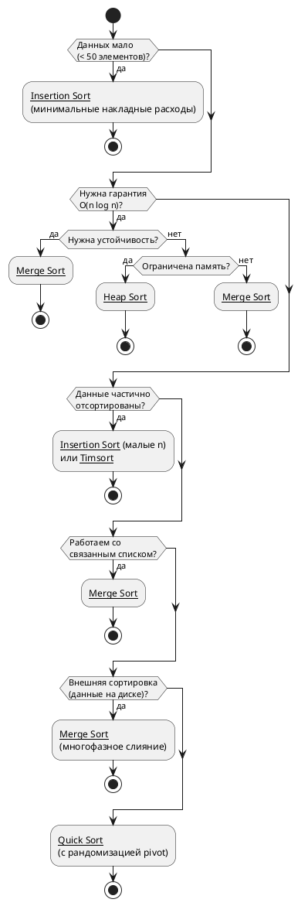

## Введение
 
Данный справочник охватывает пять классических алгоритмов сортировки — от простейших квадратичных до эффективных O(n log n). Для каждого алгоритма приведены: принцип работы, блок-схема, реализация на C# с комментариями, анализ сложности и рекомендации по применению.
 
> **Соглашение:** Во всех примерах сортировка выполняется **по возрастанию** для массива целых чисел `int[] arr`.

## [[1. Bubble Sort (Сортировка пузырьком)]] 
## [[5. Heap Sort (Пирамидальная сортировка)]] 

## [[2. Insertion Sort (Сортировка вставками)]] 
## [[3. Merge Sort (Сортировка слиянием)]] 
## [[4. Quick Sort (Быстрая сортировка)]] 

## Сравнительная таблица

> **lg n** = log₂ n

| Алгоритм       | Best      | Average   | Worst     | Память  | Устойчивость | In-place |
| -------------- | --------- | --------- | --------- | ------- | ------------ | -------- |
| Bubble Sort    | O(n)      | O(n²)     | O(n²)     | O(1)    | Да           | Да       |
| Insertion Sort | O(n)      | O(n²)     | O(n²)     | O(1)    | Да           | Да       |
| Merge Sort     | O(n·lg n) | O(n·lg n) | O(n·lg n) | O(n)    | Да           | Нет      |
| Quick Sort     | O(n·lg n) | O(n·lg n) | O(n²)     | O(lg n) | Нет          | Да       |
| Heap Sort      | O(n·lg n) | O(n·lg n) | O(n·lg n) | O(1)    | Нет          | Да       |
### Как выбрать алгоритм
 

## Benchmarks
| Method           | ArraySize | InputDataType   | Mean                | Error            | StdDev           | Median              | Rank | Gen0      | Allocated  |
|----------------- |---------- |---------------- |--------------------:|-----------------:|-----------------:|--------------------:|-----:|----------:|-----------:|
| 'Quick Sort'     | 100000    | Sorted          |                  NA |               NA |               NA |                  NA |    ? |        NA |         NA |
| 'Quick Sort'     | 100000    | Reversed        |                  NA |               NA |               NA |                  NA |    ? |        NA |         NA |
| 'Bubble Sort'    | 100       | Sorted          |            832.0 ns |         46.95 ns |        138.45 ns |            800.0 ns |    1 |         - |          - |
| 'Insertion Sort' | 100       | Sorted          |          1,285.7 ns |        109.19 ns |        318.50 ns |          1,100.0 ns |    2 |         - |          - |
| 'Insertion Sort' | 100       | PartiallySorted |          3,153.3 ns |         55.21 ns |         51.64 ns |          3,200.0 ns |    3 |         - |          - |
| 'Heap Sort'      | 100       | Reversed        |          5,793.9 ns |        124.45 ns |        365.00 ns |          5,800.0 ns |    4 |         - |          - |
| 'Bubble Sort'    | 1000      | Sorted          |          6,184.4 ns |        361.04 ns |      1,041.69 ns |          5,950.0 ns |    4 |         - |          - |
| 'Heap Sort'      | 100       | Sorted          |          6,571.1 ns |        190.16 ns |        551.69 ns |          6,500.0 ns |    4 |         - |          - |
| 'Heap Sort'      | 100       | PartiallySorted |          6,633.3 ns |        133.53 ns |        173.62 ns |          6,650.0 ns |    4 |         - |          - |
| 'Heap Sort'      | 100       | Random          |          7,521.4 ns |        201.42 ns |        587.54 ns |          7,600.0 ns |    5 |         - |          - |
| 'Quick Sort'     | 100       | Random          |          8,430.0 ns |        272.09 ns |        802.27 ns |          8,550.0 ns |    6 |         - |          - |
| 'Insertion Sort' | 1000      | Sorted          |          8,674.7 ns |        510.62 ns |      1,465.05 ns |          8,400.0 ns |    6 |         - |          - |
| 'Bubble Sort'    | 10000     | Sorted          |          9,379.4 ns |        345.29 ns |      1,001.76 ns |          9,100.0 ns |    6 |         - |          - |
| 'Insertion Sort' | 100       | Reversed        |         10,003.6 ns |        284.33 ns |        824.88 ns |          9,850.0 ns |    6 |         - |          - |
| 'Insertion Sort' | 100       | Random          |         10,068.4 ns |        437.81 ns |      1,277.13 ns |          9,750.0 ns |    6 |         - |          - |
| 'Bubble Sort'    | 100       | PartiallySorted |         10,707.1 ns |        279.34 ns |        814.84 ns |         10,700.0 ns |    6 |         - |          - |
| 'Quick Sort'     | 100       | PartiallySorted |         11,842.6 ns |        628.64 ns |      1,803.67 ns |         11,250.0 ns |    6 |         - |          - |
| 'Insertion Sort' | 10000     | Sorted          |         12,953.1 ns |        485.66 ns |      1,416.70 ns |         12,750.0 ns |    7 |         - |          - |
| 'Merge Sort'     | 100       | Sorted          |         13,106.2 ns |        976.09 ns |      2,831.81 ns |         13,400.0 ns |    7 |         - |     8000 B |
| 'Merge Sort'     | 100       | PartiallySorted |         14,333.5 ns |      1,031.09 ns |      2,991.37 ns |         14,250.0 ns |    7 |         - |     8000 B |
| 'Bubble Sort'    | 100       | Reversed        |         16,984.5 ns |        621.58 ns |      1,803.32 ns |         16,300.0 ns |    8 |         - |          - |
| 'Merge Sort'     | 100       | Random          |         17,620.0 ns |      1,056.06 ns |      3,030.05 ns |         18,300.0 ns |    8 |         - |     8000 B |
| 'Bubble Sort'    | 100       | Random          |         18,502.2 ns |        607.10 ns |      1,682.26 ns |         18,300.0 ns |    8 |         - |          - |
| 'Merge Sort'     | 100       | Reversed        |         19,003.1 ns |      1,778.41 ns |      5,159.49 ns |         20,200.0 ns |    8 |         - |     8000 B |
| 'Quick Sort'     | 100       | Reversed        |         22,872.0 ns |        442.40 ns |      1,173.19 ns |         22,550.0 ns |    9 |         - |          - |
| 'Insertion Sort' | 1000      | PartiallySorted |         26,790.6 ns |        535.09 ns |      1,543.86 ns |         26,650.0 ns |   10 |         - |          - |
| 'Quick Sort'     | 100       | Sorted          |         29,624.7 ns |        644.24 ns |      1,785.18 ns |         28,800.0 ns |   11 |         - |          - |
| 'Bubble Sort'    | 100000    | Sorted          |         50,219.0 ns |        991.32 ns |      1,180.09 ns |         49,800.0 ns |   12 |         - |          - |
| 'Insertion Sort' | 100000    | Sorted          |         76,142.9 ns |        766.00 ns |        679.04 ns |         76,300.0 ns |   13 |         - |          - |
| 'Merge Sort'     | 1000      | Sorted          |         79,924.0 ns |      5,978.01 ns |     17,626.29 ns |         82,400.0 ns |   13 |         - |    92304 B |
| 'Heap Sort'      | 1000      | PartiallySorted |         80,985.9 ns |      1,622.39 ns |      3,979.74 ns |         81,200.0 ns |   13 |         - |          - |
| 'Heap Sort'      | 1000      | Reversed        |         81,020.8 ns |      1,678.39 ns |      4,842.53 ns |         81,300.0 ns |   13 |         - |          - |
| 'Heap Sort'      | 1000      | Sorted          |         84,330.6 ns |      1,671.27 ns |      2,792.32 ns |         84,150.0 ns |   13 |         - |          - |
| 'Heap Sort'      | 1000      | Random          |         88,121.7 ns |      1,588.12 ns |      3,059.77 ns |         88,550.0 ns |   13 |         - |          - |
| 'Quick Sort'     | 1000      | Random          |         90,678.0 ns |      1,806.88 ns |      4,003.92 ns |         89,200.0 ns |   13 |         - |          - |
| 'Merge Sort'     | 1000      | PartiallySorted |         91,850.5 ns |      4,835.08 ns |     14,180.44 ns |         97,700.0 ns |   13 |         - |    92304 B |
| 'Merge Sort'     | 1000      | Reversed        |         92,304.1 ns |      5,124.58 ns |     14,867.34 ns |         93,400.0 ns |   13 |         - |    92304 B |
| 'Insertion Sort' | 1000      | Random          |        122,420.0 ns |      2,419.75 ns |      2,263.44 ns |        121,300.0 ns |   14 |         - |          - |
| 'Merge Sort'     | 1000      | Random          |        127,398.0 ns |      5,065.29 ns |     14,935.13 ns |        128,900.0 ns |   14 |         - |    92304 B |
| 'Quick Sort'     | 1000      | PartiallySorted |        172,264.0 ns |      3,364.12 ns |      4,491.00 ns |        170,400.0 ns |   15 |         - |          - |
| 'Insertion Sort' | 1000      | Reversed        |        261,775.0 ns |      2,520.09 ns |      1,967.52 ns |        261,250.0 ns |   16 |         - |          - |
| 'Bubble Sort'    | 1000      | PartiallySorted |        318,423.1 ns |      3,363.49 ns |      2,808.66 ns |        318,100.0 ns |   17 |         - |          - |
| 'Bubble Sort'    | 1000      | Random          |        453,414.8 ns |      8,978.66 ns |     12,586.83 ns |        451,100.0 ns |   18 |         - |          - |
| 'Merge Sort'     | 10000     | Sorted          |        545,615.4 ns |      5,041.02 ns |      4,209.48 ns |        545,500.0 ns |   19 |         - |  1072016 B |
| 'Bubble Sort'    | 1000      | Reversed        |        565,130.8 ns |      8,297.29 ns |      6,928.61 ns |        561,900.0 ns |   19 |         - |          - |
| 'Merge Sort'     | 10000     | Reversed        |        650,000.0 ns |     12,817.60 ns |     18,382.62 ns |        645,650.0 ns |   20 |         - |  1072016 B |
| 'Merge Sort'     | 10000     | PartiallySorted |        721,284.6 ns |      7,800.55 ns |      6,513.81 ns |        722,100.0 ns |   21 |         - |  1072016 B |
| 'Heap Sort'      | 10000     | Sorted          |        761,346.7 ns |     15,196.68 ns |     33,989.56 ns |        767,950.0 ns |   21 |         - |          - |
| 'Heap Sort'      | 10000     | Reversed        |        775,003.5 ns |     15,405.12 ns |     33,489.48 ns |        783,000.0 ns |   21 |         - |          - |
| 'Heap Sort'      | 10000     | PartiallySorted |        953,955.0 ns |     24,092.79 ns |     71,038.13 ns |        940,950.0 ns |   22 |         - |          - |
| 'Quick Sort'     | 10000     | Random          |        995,265.0 ns |     18,830.95 ns |     21,685.75 ns |        999,450.0 ns |   22 |         - |          - |
| 'Heap Sort'      | 10000     | Random          |      1,002,691.7 ns |     19,827.30 ns |     33,126.96 ns |      1,001,550.0 ns |   22 |         - |          - |
| 'Merge Sort'     | 10000     | Random          |      1,129,235.7 ns |     18,382.19 ns |     16,295.33 ns |      1,125,750.0 ns |   23 |         - |  1072016 B |
| 'Insertion Sort' | 10000     | PartiallySorted |      1,399,032.0 ns |     18,748.41 ns |     25,028.60 ns |      1,402,700.0 ns |   24 |         - |          - |
| 'Quick Sort'     | 10000     | PartiallySorted |      1,422,480.0 ns |    244,107.01 ns |    719,755.09 ns |      1,821,700.0 ns |   25 |         - |          - |
| 'Quick Sort'     | 1000      | Reversed        |      1,720,300.0 ns |     26,992.80 ns |     30,002.43 ns |      1,717,700.0 ns |   25 |         - |          - |
| 'Quick Sort'     | 1000      | Sorted          |      2,653,758.3 ns |     22,769.30 ns |     17,776.77 ns |      2,653,400.0 ns |   26 |         - |          - |
| 'Merge Sort'     | 100000    | PartiallySorted |      3,755,525.0 ns |     61,333.82 ns |    126,664.98 ns |      3,730,150.0 ns |   27 | 1000.0000 | 12031184 B |
| 'Heap Sort'      | 100000    | Sorted          |      4,790,929.1 ns |     64,848.37 ns |    120,200.62 ns |      4,773,050.0 ns |   28 |         - |          - |
| 'Quick Sort'     | 100000    | PartiallySorted |      4,885,707.7 ns |     54,706.90 ns |     45,682.74 ns |      4,872,800.0 ns |   28 |         - |          - |
| 'Heap Sort'      | 100000    | Reversed        |      5,062,303.8 ns |     58,711.99 ns |    121,250.45 ns |      5,015,950.0 ns |   28 |         - |          - |
| 'Quick Sort'     | 100000    | Random          |      5,257,746.2 ns |     37,757.36 ns |     31,529.10 ns |      5,252,400.0 ns |   28 |         - |          - |
| 'Merge Sort'     | 100000    | Sorted          |      5,912,484.2 ns |    114,157.93 ns |    126,886.23 ns |      5,898,100.0 ns |   29 | 1000.0000 | 12031184 B |
| 'Heap Sort'      | 100000    | PartiallySorted |      6,420,850.0 ns |     37,007.95 ns |     53,075.70 ns |      6,418,500.0 ns |   30 |         - |          - |
| 'Merge Sort'     | 100000    | Reversed        |      6,772,328.6 ns |    113,543.04 ns |    100,652.95 ns |      6,753,700.0 ns |   31 | 1000.0000 | 12031184 B |
| 'Merge Sort'     | 100000    | Random          |      7,388,907.7 ns |     59,879.06 ns |     50,001.72 ns |      7,402,100.0 ns |   32 | 1000.0000 | 12031184 B |
| 'Heap Sort'      | 100000    | Random          |      8,346,872.7 ns |    126,938.69 ns |    155,892.13 ns |      8,349,050.0 ns |   33 |         - |          - |
| 'Insertion Sort' | 10000     | Random          |     10,998,687.5 ns |    216,361.48 ns |    212,495.90 ns |     11,006,300.0 ns |   34 |         - |          - |
| 'Quick Sort'     | 10000     | Reversed        |     19,472,153.8 ns |    360,053.31 ns |    300,660.82 ns |     19,325,000.0 ns |   35 |         - |          - |
| 'Insertion Sort' | 10000     | Reversed        |     21,912,253.3 ns |    394,915.33 ns |    369,404.05 ns |     21,896,500.0 ns |   36 |         - |          - |
| 'Bubble Sort'    | 10000     | PartiallySorted |     25,803,246.5 ns |    513,794.31 ns |  1,397,815.42 ns |     25,382,800.0 ns |   37 |         - |          - |
| 'Quick Sort'     | 10000     | Sorted          |     27,913,605.9 ns |    553,173.79 ns |    568,068.76 ns |     27,895,400.0 ns |   37 |         - |          - |
| 'Bubble Sort'    | 10000     | Random          |     37,595,221.4 ns |    483,044.38 ns |    428,206.26 ns |     37,621,950.0 ns |   38 |         - |          - |
| 'Bubble Sort'    | 10000     | Reversed        |     55,544,846.7 ns |  1,009,667.55 ns |    944,443.65 ns |     55,532,800.0 ns |   39 |         - |          - |
| 'Insertion Sort' | 100000    | PartiallySorted |    130,645,392.9 ns |  1,198,627.29 ns |  1,062,551.87 ns |    130,812,800.0 ns |   40 |         - |          - |
| 'Insertion Sort' | 100000    | Random          |  1,091,731,728.6 ns |  2,491,676.38 ns |  2,208,806.21 ns |  1,092,436,800.0 ns |   41 |         - |          - |
| 'Insertion Sort' | 100000    | Reversed        |  2,202,889,014.3 ns | 26,451,752.33 ns | 23,448,789.46 ns |  2,193,387,650.0 ns |   42 |         - |          - |
| 'Bubble Sort'    | 100000    | PartiallySorted |  3,459,792,253.8 ns | 11,779,224.79 ns |  9,836,186.19 ns |  3,461,528,200.0 ns |   43 |         - |          - |
| 'Bubble Sort'    | 100000    | Reversed        |  5,606,639,085.7 ns | 10,655,777.04 ns |  9,446,068.79 ns |  5,604,738,550.0 ns |   44 |         - |          - |
| 'Bubble Sort'    | 100000    | Random          | 11,538,957,284.6 ns | 42,829,577.28 ns | 35,764,636.80 ns | 11,526,932,700.0 ns |   45 |         - |          - |