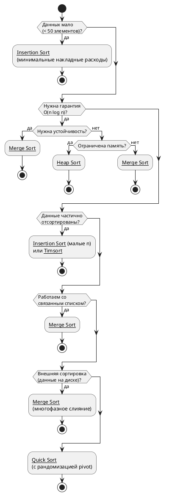

## Введение
 
Данный справочник охватывает пять классических алгоритмов сортировки — от простейших квадратичных до эффективных O(n log n). Для каждого алгоритма приведены: принцип работы, блок-схема, реализация на C# с комментариями, анализ сложности и рекомендации по применению.
 
> **Соглашение:** Во всех примерах сортировка выполняется **по возрастанию** для массива целых чисел `int[] arr`.

## [[1. Bubble Sort (Сортировка пузырьком)]] 
## [[5. Heap Sort (Пирамидальная сортировка)]] 

## [[2. Insertion Sort (Сортировка вставками)]] 
## [[3. Merge Sort (Сортировка слиянием)]] 
## [[4. Quick Sort (Быстрая сортировка)]] 

## Сравнительная таблица

> **lg n** = log₂ n

| Алгоритм       | Best      | Average   | Worst     | Память  | Устойчивость | In-place |
| -------------- | --------- | --------- | --------- | ------- | ------------ | -------- |
| Bubble Sort    | O(n)      | O(n²)     | O(n²)     | O(1)    | Да           | Да       |
| Insertion Sort | O(n)      | O(n²)     | O(n²)     | O(1)    | Да           | Да       |
| Merge Sort     | O(n·lg n) | O(n·lg n) | O(n·lg n) | O(n)    | Да           | Нет      |
| Quick Sort     | O(n·lg n) | O(n·lg n) | O(n²)     | O(lg n) | Нет          | Да       |
| Heap Sort      | O(n·lg n) | O(n·lg n) | O(n·lg n) | O(1)    | Нет          | Да       |
### Как выбрать алгоритм
 

