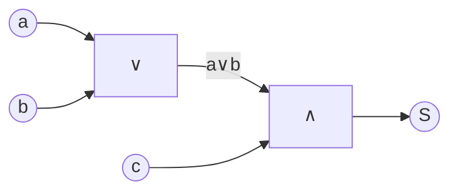
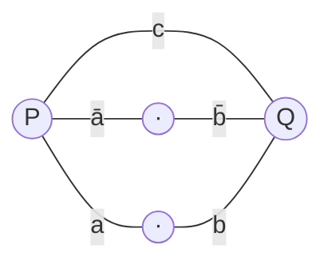
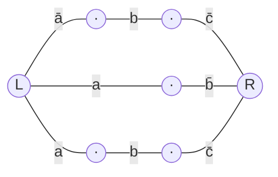

## Задача 1. Сокращённая ДНФ функции Q методом Квайна

$$Q(a,b,c,d) = a\bar b d \lor a\bar b c \lor \bar c \bar d$$

### 1. Приведение к СДНФ.

$$ 
\begin{align*}
&a\bar b d = a\bar b d(c\lor\bar c) = a\bar b c d \lor a\bar b \bar c d,\\
&a\bar b c = a\bar b c(d\lor\bar d) = a\bar b c d \lor a\bar b c \bar d,\\
&\bar c\bar d = \bar c\bar d(a\lor\bar a)(b\lor\bar b) = \bar a\bar b\bar c\bar d \lor \bar a b\bar c\bar d \lor a\bar b\bar c\bar d \lor a b\bar c\bar d.
\end{align*}
$$

После удаления повторов остаётся **7 минтермов**:

|#|$abcd$|Конъюнкция|
|---|---|---|
|1|0000|$\bar a\bar b\bar c\bar d$|
|2|0100|$\bar a b\bar c\bar d$|
|3|1000|$a\bar b\bar c\bar d$|
|4|1001|$a\bar b\bar c d$|
|5|1010|$a\bar b c\bar d$|
|6|1011|$a\bar b c d$|
|7|1100|$a b\bar c\bar d$|

### 2. Группировка по числу единиц.

| Группа | Минтермы         |
| ------ | ---------------- |
| 0 ед.  | 0000             |
| 1 ед.  | 0100, 1000       |
| 2 ед.  | 1001, 1010, 1100 |
| 3 ед.  | 1011             |

### 3. Склеивание ранга 1 (сравниваем соседние группы):

| Пара        | Результат | Конъюнкция               |
| ----------- | --------- | ------------------------ |
| 0000 ↔ 0100 | 0_00      | $\bar a\bar c\bar d$ (A) |
| 0000 ↔ 1000 | _000      | $\bar b\bar c\bar d$ (B) |
| 0100 ↔ 1100 | _100      | $b\bar c\bar d$ (C)      |
| 1000 ↔ 1001 | 100_      | $a\bar b\bar c$ (D)      |
| 1000 ↔ 1010 | 10_0      | $a\bar b\bar d$ (E)      |
| 1000 ↔ 1100 | 1_00      | $a\bar c\bar d$ (F)      |
| 1001 ↔ 1011 | 10_1      | $a\bar b d$ (G)          |
| 1010 ↔ 1011 | 101_      | $a\bar b c$ (H)          |

Все 7 минтермов участвовали хотя бы в одной склейке ⇒ среди минтермов **простых импликант нет**.

### 4. Склеивание ранга 2. 
   
Группируем конъюнкты ранга 1 по позиции прочерка:

| Позиция «–» | Конъюнкты          |
| ----------- | ------------------ |
| 1-я ($a$)   | B (–000), C (–100) |
| 2-я ($b$)   | A (0–00), F (1–00) |
| 3-я ($c$)   | E (10–0), G (10–1) |
| 4-я ($d$)   | D (100–), H (101–) |

Внутри каждой группы — ровно одна пара, отличающаяся в одной позиции:

| Пара               | Результат | Конъюнкция             |
| ------------------ | --------- | ---------------------- |
| B ↔ C (–000, –100) | __00      | $\bar c\bar d$         |
| A ↔ F (0–00, 1–00) | __00      | $\bar c\bar d$ (дубль) |
| E ↔ G (10–0, 10–1) | 10__      | $a\bar b$              |
| D ↔ H (100–, 101–) | 10__      | $a\bar b$ (дубль)      |

Все 8 конъюнктов ранга 1 склеились. На ранге 2 получаем **два уникальных** конъюнкта: $\bar c\bar d$ и $a\bar b$.

###  5. Склеивание ранга 3.
Прочерки у $\bar c\bar d$ — в позициях 1, 2; у $a\bar b$ — в позициях 3, 4. Позиции прочерков **разные** ⇒ склейка невозможна. Процесс завершён.

### 6. Простые импликанты: 
$\bar c\bar d,\ a\bar b$.
### 7. Сокращённая ДНФ

$$\boxed{,Q_{\text{сокр}}(a,b,c,d) = a\bar b ,\lor, \bar c\bar d,}$$

**Проверка покрытия** (каждый минтерм СДНФ покрыт хотя бы одной простой импликантой):

|Минтерм|$a\bar b$|$\bar c\bar d$|
|---|:-:|:-:|
|0000||✓|
|0100||✓|
|1000|✓|✓|
|1001|✓||
|1010|✓||
|1011|✓||
|1100||✓|

Все семь минтермов покрыты; обратно — обе импликанты не выходят за пределы носителя $Q$. ✓

---

## Задача 2. Кратчайшая ДНФ функции $K$ методом карт Карно

$$K(a,b,c,d) = \bar a c \lor bc \lor ab \lor a\bar b d \lor \bar b c d \lor a c d$$

### 1. Какие наборы дают $K=1$.

| Конъюнкция   | Покрывает наборы $abcd$ |
| ------------ | ----------------------- |
| $\bar a c$   | 0010, 0011, 0110, 0111  |
| $bc$         | 0110, 0111, 1110, 1111  |
| $ab$         | 1100, 1101, 1110, 1111  |
| $a\bar b d$  | 1001, 1011              |
| $\bar b c d$ | 0011, 1011              |
| $acd$        | 1011, 1111              |

Объединение (10 единиц): **0010, 0011, 0110, 0111, 1001, 1011, 1100, 1101, 1110, 1111**.

### 2. Карта Карно.

| $ab\backslash cd$ | **00** | **01** | **11** | **10** |
| ----------------- | :----: | :----: | :----: | :----: |
| **00**            |   0    |   0    |   1    |   1    |
| **01**            |   0    |   0    |   1    |   1    |
| **11**            |   1    |   1    |   1    |   1    |
| **10**            |   0    |   1    |   1    |   0    |

### 3. Максимальные группы (простые импликанты).

| #   | Описание группы (клетки)                                             | Фикс. перем. | Импликанта |
| --- | -------------------------------------------------------------------- | ------------ | ---------- |
| 1   | Квадрат 2×2: $ab\in{00,01}$, $cd\in{11,10}$ — 0010, 0011, 0110, 0111 | $a=0,\ c=1$  | $\bar a c$ |
| 2   | Квадрат 2×2: $ab\in{01,11}$, $cd\in{11,10}$ — 0110, 0111, 1110, 1111 | $b=1,\ c=1$  | $bc$       |
| 3   | Строка $ab=11$ — 1100, 1101, 1111, 1110                              | $a=1,\ b=1$  | $ab$       |
| 4   | Квадрат 2×2: $ab\in{11,10}$, $cd\in{01,11}$ — 1101, 1111, 1001, 1011 | $a=1,\ d=1$  | $ad$       |
| 5   | Столбец $cd=11$ — 0011, 0111, 1111, 1011                             | $c=1,\ d=1$  | $cd$       |

(Размер каждой группы $=4$ — больше нельзя: попытка расширить любую из них даёт нули в карте.)

Сокращённая ДНФ: $;K_{\text{сокр}} = \bar a c \lor bc \lor ab \lor ad \lor cd.$

### 4. Обязательные простые импликанты. 

Для каждой единицы смотрим, какими импликантами она покрыта:

|Минтерм|$\bar a c$|$bc$|$ab$|$ad$|$cd$|
|---|:-:|:-:|:-:|:-:|:-:|
|0010|✓|||||
|0011|✓||||✓|
|0110|✓|✓||||
|0111|✓|✓|||✓|
|1001||||✓||
|1011||||✓|✓|
|1100|||✓|||
|1101|||✓|✓||
|1110||✓|✓|||
|1111||✓|✓|✓|✓|

Единичные покрытия:

- $0010$ — только $\bar a c$ ⇒ **$\bar a c$ обязательна**.
- $1001$ — только $ad$ ⇒ **$ad$ обязательна**.
- $1100$ — только $ab$ ⇒ **$ab$ обязательна**.

### 5. Проверка покрытия обязательными.

$$
\begin{flalign}
& \bar a c \cup ab \cup ad = \{0010,0011,0110,0111\} &\\
& \cup \{1100,1101,1110,1111\} &\\
& \cup \{1001,1011,1101,1111\} &
\end{flalign}
$$
— это все 10 единиц. Значит $bc$ и $cd$ не нужны.

Меньше чем тремя группами обойтись нельзя: 
максимальная группа покрывает 4 клетки, $4+4<10$.

### 6. Ответ. $$\boxed{K_{\text{кратч}}(a,b,c,d) ;=; \bar a c ,\lor, ab ,\lor, ad,}$$
(3 конъюнкции, 6 литералов.)

---

## Задача 3. СФЭ для S при ограничении сложности m=2

$$S(a,b,c) = abc \oplus ac \oplus bc, \qquad m=2.$$
 
### 1. Упрощение $S$.
 
Вынесем $ac$ из первых двух слагаемых (дистрибутивность AND по XOR):
 $$abc \oplus ac \;=\; ac\cdot b \oplus ac\cdot 1 \;=\; ac(b\oplus 1) \;=\; ac\bar b \;=\; a\bar b c.$$
 тогда, $\;S = a\bar b c \,\oplus\, bc.\;$
 
Слагаемые $a\bar b c$ и $bc$ **не пересекаются** ($a\bar b c$ требует $b=0$, $bc$ требует $b=1$), значит на любом наборе сразу обе единицы не возникают, и XOR совпадает с дизъюнкцией:
 $$S \;=\; a\bar b c \,\lor\, bc \;=\; c(a\bar b \lor b) \;=\; c(a\lor b).$$
 > тождество $b\lor a\bar b = b\lor a$ — частный случай $x\lor \bar x y = x\lor y$.)
 
### 2. Проверка по таблице истинности.
 
| $a$ | $b$ | $c$ | $abc$ | $ac$ | $bc$ | $abc\oplus ac\oplus bc$ | $c(a\lor b)$ |
| :-: | :-: | :-: | :---: | :--: | :--: | :---------------------: | :----------: |
|  0  |  0  |  0  |   0   |  0   |  0   |            0            |      0       |
|  0  |  0  |  1  |   0   |  0   |  0   |            0            |      0       |
|  0  |  1  |  0  |   0   |  0   |  0   |            0            |      0       |
|  0  |  1  |  1  |   0   |  0   |  1   |            1            |      1       |
|  1  |  0  |  0  |   0   |  0   |  0   |            0            |      0       |
|  1  |  0  |  1  |   0   |  1   |  0   |            1            |      1       |
|  1  |  1  |  0  |   0   |  0   |  0   |            0            |      0       |
|  1  |  1  |  1  |   1   |  1   |  1   |    $1\oplus1\oplus1=1$  |      1       |
 
Все 8 строк совпали. ✓
 
### 3. Построение СФЭ.
 
Формула $S=c\cdot(a\lor b)$ даёт два бинарных вентиля:
 
- $E_1$: $\;g_1 = a\lor b\;$ — элемент **∨** (вход: $a,b$);
- $E_2$: $\;S = c\land g_1\;$ — элемент **∧** (вход: $c$ и выход $E_1$).
**сложность $L(S)=2 \le m=2$** ✓.
 
**Схема:**
 

**Ответ.** $\;S = c(a\lor b),\;$ СФЭ из двух элементов ($\lor$ и $\land$), $L(S)=2$.

---
## Задача 4. Анализ СФЭ

![[Pasted image 20260521163826.png]]
### Определение топологии
 
На схеме три вентиля NOR ($\downarrow$), два промежуточных $\lor$, один выходной $\lor$. Из расположения точек ответвления на вертикалях $a, \bar a, b, \bar b, c, \bar c$ установлено:
 
| Элемент       | Верхний вход | Нижний вход |
| ------------- | :----------: | :---------: |
| $\downarrow_1$ |     $a$      |     $b$     |
| $\downarrow_2$ |   $\bar a$   |  $\bar c$   |
| $\downarrow_3$ |   $\bar b$   |     $c$     |
| $\vee_1$      | $\downarrow_1$ | $\downarrow_2$ |
| $\vee_2$      | $\downarrow_3$ |  $\bar a$   |
| $\vee_3$ (вых.) | $\vee_1$    |  $\vee_2$   |

 
### 1. Выходы каждого блока.
 
- $\downarrow_1: \quad a \downarrow b \;=\; \overline{a \lor b} \;=\; \bar a\bar b$.
- $\downarrow_2: \quad \bar a \downarrow \bar c \;=\; \overline{\bar a \lor \bar c} \;=\; ac$.
- $\downarrow_3: \quad \bar b \downarrow c \;=\; \overline{\bar b \lor c} \;=\; b\bar c$.
### 2. Промежуточные $\lor$.
 
- $\vee_1 \;=\; (\downarrow_1) \lor (\downarrow_2) \;=\; \bar a\bar b \lor ac$.
- $\vee_2 \;=\; (\downarrow_3) \lor \bar a \;=\; b\bar c \lor \bar a$.

### 3. Выход.
$$f \;=\; \vee_1 \lor \vee_2 \;=\; \bar a\bar b \,\lor\, ac \,\lor\, b\bar c \,\lor\, \bar a.$$
### 4. Упрощение.
 
Поглощение $\bar a\bar b \subseteq \bar a$ убирает первое слагаемое:
$$f \;=\; \bar a \,\lor\, ac \,\lor\, b\bar c.$$
Правило $X \lor \bar X Y = X \lor Y$: $\;c \lor \bar c\cdot\bar a = c \lor \bar a\;$ даёт $\bar a \lor ac = \bar a \lor c$. 
Получаем:
 $$f \;=\; \bar a \,\lor\, c \,\lor\, b\bar c.$$
 
Ещё раз тем же правилом: $\;c \lor b\bar c = c \lor b\;$:
 
$$\boxed{\,f(a,b,c) \;=\; \bar a \,\lor\, b \,\lor\, c\,}$$
 
Эквивалентно: $\;f = \overline{a\bar b\bar c} = a \to (b\lor c).\;$ Функция равна 0 ровно на одном наборе $(a,b,c)=(1,0,0)$.
 
### 5. Проверка по таблице истинности.
 
| $a$ | $b$ | $c$ | $\bar a\bar b$ | $ac$ | $b\bar c$ | $\bar a$ | $f_{\text{исх}}$ | $\bar a\lor b\lor c$ |
| :-: | :-: | :-: | :------------: | :--: | :-------: | :------: | :--------------: | :------------------: |
|  0  |  0  |  0  |       1        |  0   |     0     |    1     |        1         |          1           |
|  0  |  0  |  1  |       1        |  0   |     0     |    1     |        1         |          1           |
|  0  |  1  |  0  |       0        |  0   |     1     |    1     |        1         |          1           |
|  0  |  1  |  1  |       0        |  0   |     0     |    1     |        1         |          1           |
|  1  |  0  |  0  |       0        |  0   |     0     |    0     |        0         |          0           |
|  1  |  0  |  1  |       0        |  1   |     0     |    0     |        1         |          1           |
|  1  |  1  |  0  |       0        |  0   |     1     |    0     |        1         |          1           |
|  1  |  1  |  1  |       0        |  1   |     0     |    0     |        1         |          1           |
 
Все строки совпадают. ✓

---

## Задача 5. РКС для функции R
$$R(a,b,c) \;=\; ab \,\lor\, a\bar b c \,\lor\, \bar a b c \,\lor\, \bar a\bar b.$$
 
### 1. Таблица истинности и карта Карно.
 
| $a$ | $b$ | $c$ | $ab$ | $a\bar b c$ | $\bar a b c$ | $\bar a\bar b$ | $R$ |
| :-: | :-: | :-: | :--: | :---------: | :----------: | :------------: | :-: |
|  0  |  0  |  0  |  0   |      0      |      0       |       1        |  1  |
|  0  |  0  |  1  |  0   |      0      |      0       |       1        |  1  |
|  0  |  1  |  0  |  0   |      0      |      0       |       0        |  0  |
|  0  |  1  |  1  |  0   |      0      |      1       |       0        |  1  |
|  1  |  0  |  0  |  0   |      0      |      0       |       0        |  0  |
|  1  |  0  |  1  |  0   |      1      |      0       |       0        |  1  |
|  1  |  1  |  0  |  1   |      0      |      0       |       0        |  1  |
|  1  |  1  |  1  |  1   |      0      |      0       |       0        |  1  |
 
Карта Карно ($a$ — строки, $bc$ — столбцы в коде Грея):
 
| $a\backslash bc$ | **00** | **01** | **11** | **10** |
| :--------------: | :----: | :----: | :----: | :----: |
|     **0**        |   1    |   1    |   1    |   0    |
|     **1**        |   0    |   1    |   1    |   1    |
 
### 2. Группы.
 
- Столбцы $bc=01$ и $bc=11$ (обе строки) — это весь столбец $c=1$: импликанта $c$ (покрывает 001, 011, 101, 111).
- Клетка 000 — не покрыта $c$; склеивается с 001: импликанта $\bar a\bar b$ (покрывает 000, 001).
- Клетка 110 — не покрыта; склеивается с 111: импликанта $ab$ (покрывает 110, 111).
Каждая из трёх импликант обязательна: 000 покрыта только $\bar a\bar b$, 110 — только $ab$, а $c$ единственная покрывает 011 и 101.
 
$$\boxed{\,R(a,b,c) \;=\; c \,\lor\, \bar a\bar b \,\lor\, ab\,}$$
### 3. Сверка
(все 8 строк совпадают с исходной таблицей):
 
| $abc$ | $c$ | $\bar a\bar b$ | $ab$ | $R$ |
| :---: | :-: | :------------: | :--: | :-: |
| 000   |  0  |       1        |  0   |  1  |
| 001   |  1  |       1        |  0   |  1  |
| 010   |  0  |       0        |  0   |  0  |
| 011   |  1  |       0        |  0   |  1  |
| 100   |  0  |       0        |  0   |  0  |
| 101   |  1  |       0        |  0   |  1  |
| 110   |  0  |       0        |  1   |  1  |
| 111   |  1  |       0        |  1   |  1  |
 
Совпало. ✓
 
### 4. Построение РКС.
 
Дизъюнкция трёх членов → **три параллельные ветви** между полюсами $P$ (вход) и $Q$ (выход):
 
- ветвь 1: один контакт $c$;
- ветвь 2: последовательно $\bar a$ и $\bar b$;
- ветвь 3: последовательно $a$ и $b$.
**Число контактов: $1 + 2 + 2 = 5$.**
 

---

## Задача 6. Анализ РКС

![[Pasted image 20260521163856.png|560]]
### Определение топологии (из схемы)
 
Схема состоит из двух последовательно соединённых блоков.
 
**Левый блок** (между входным узлом $L$ и средним узлом $M$): два параллельных пути по два контакта последовательно:
 
| Путь        | Контакты            |
| ----------- | ------------------- |
| верхний     | $c$, затем $b$      |
| нижний      | $a$, затем $\bar b$ |
 
### Функции блоков.
 
- Левый блок (параллель из двух последовательных цепей): $\;\Phi_L = cb \,\lor\, a\bar b.$
- Правый блок (параллель из одиночных контактов): $\;\Phi_R = \bar c \,\lor\, \bar a.$

### 2. Последовательное соединение.
 
$$\Phi(a,b,c) \;=\; \Phi_L\cdot\Phi_R \;=\; (cb \lor a\bar b)(\bar c \lor \bar a).$$
 
### 3. Раскрытие.
 
$$
\begin{aligned}
\Phi &= cb\cdot\bar c \;\lor\; cb\cdot\bar a \;\lor\; a\bar b\cdot\bar c \;\lor\; a\bar b\cdot\bar a \\
     &= 0 \;\lor\; \bar a bc \;\lor\; a\bar b\bar c \;\lor\; 0 \\[2pt]
     &= \bar a bc \,\lor\, a\bar b\bar c.
\end{aligned}
$$
 
Дальнейшая минимизация невозможна (по карте Карно — две изолированные единицы, склейка не проходит).
 
### 4. Сверка по таблице истинности.
 
| $a$ | $b$ | $c$ | $cb$ | $a\bar b$ | $\Phi_L$ | $\bar c$ | $\bar a$ | $\Phi_R$ | $\Phi$ | $\bar a bc\lor a\bar b\bar c$ |
| :-: | :-: | :-: | :--: | :-------: | :------: | :------: | :------: | :------: | :----: | :---------------------------: |
|  0  |  0  |  0  |  0   |     0     |    0     |    1     |    1     |    1     |   0    |               0               |
|  0  |  0  |  1  |  0   |     0     |    0     |    0     |    1     |    1     |   0    |               0               |
|  0  |  1  |  0  |  0   |     0     |    0     |    1     |    1     |    1     |   0    |               0               |
|  0  |  1  |  1  |  1   |     0     |    1     |    0     |    1     |    1     |   1    |               1               |
|  1  |  0  |  0  |  0   |     1     |    1     |    1     |    0     |    1     |   1    |               1               |
|  1  |  0  |  1  |  0   |     1     |    1     |    0     |    0     |    0     |   0    |               0               |
|  1  |  1  |  0  |  0   |     0     |    0     |    1     |    0     |    1     |   0    |               0               |
|  1  |  1  |  1  |  1   |     0     |    1     |    0     |    0     |    0     |   0    |               0               |
 
Все столбцы совпали. ✓
 
**Ответ:**
 
$$\boxed{\,\Phi(a,b,c) \;=\; \bar a\, b\, c \,\lor\, a\, \bar b\, \bar c\,}$$

---

## Задача 7. РКС методом Шеннона для функции S

$$\sigma(a,b,c) \;=\; (a\to b)\,|\,(b\to c), \qquad \text{разложение по }(a,b).$$
 
> $x\to y = \bar x\lor y$; $\;x\,|\,y = \overline{xy} = \bar x\lor\bar y$ (штрих Шеффера).
 

### Таблица истинности.
 
| $a$ | $b$ | $c$ | $a\to b$ | $b\to c$ | $\sigma=\overline{(a\to b)(b\to c)}$ |
| :-: | :-: | :-: | :------: | :------: | :----------------------------------: |
|  0  |  0  |  0  |    1     |    1     |                  0                   |
|  0  |  0  |  1  |    1     |    1     |                  0                   |
|  0  |  1  |  0  |    1     |    0     |                  1                   |
|  0  |  1  |  1  |    1     |    1     |                  0                   |
|  1  |  0  |  0  |    0     |    1     |                  1                   |
|  1  |  0  |  1  |    0     |    1     |                  1                   |
|  1  |  1  |  0  |    1     |    0     |                  1                   |
|  1  |  1  |  1  |    1     |    1     |                  0                   |
 
### 2 Кофакторы по $c$.
 
Фиксируем $a,b$ и читаем столбец $\sigma$ по двум строкам $c=0,1$:
 
| $\alpha\beta$ | $\sigma(\alpha,\beta,0)$ | $\sigma(\alpha,\beta,1)$ | $\sigma_{\alpha\beta}(c)$ |
| :-----------: | :----------------------: | :----------------------: | :-----------------------: |
|      00       |            0             |            0             |            $0$            |
|      01       |            1             |            0             |         $\bar c$          |
|      10       |            1             |            1             |            $1$            |
|      11       |            1             |            0             |         $\bar c$          |
 
Разложение Шеннона:
 
$$\sigma \;=\; \bar a\bar b\cdot 0 \;\lor\; \bar a b\cdot \bar c \;\lor\; a\bar b\cdot 1 \;\lor\; ab\cdot \bar c \;=\; \bar a b\bar c \,\lor\, a\bar b \,\lor\, ab\bar c.$$
 
Сверка с таблицей — совпадает на всех 8 наборах. ✓
 
### 3. РКС
 
Каноническая структура: четыре параллельные ветви между полюсами $L$ и $R$, у каждой — префикс из двух контактов $a/\bar a, b/\bar b$ и блок кофактора по $c$.
 
| Ветвь | Префикс по $a,b$ | Кофактор $\sigma_{\alpha\beta}(c)$ | Содержимое                       |
| :---: | :--------------: | :--------------------------------: | :------------------------------- |
|   1   | $\bar a, \bar b$ |                $0$                 | вырезается (постоянный разрыв)   |
|   2   | $\bar a, b$      |             $\bar c$               | контакт $\bar c$                 |
|   3   | $a, \bar b$      |                $1$                 | сплошной провод (никакого блока) |
|   4   | $a, b$           |             $\bar c$               | контакт $\bar c$                 |
 
Остаются **3 параллельные ветви**:
 
- ветвь 2: $\bar a \to b \to \bar c$ (3 контакта последовательно);
- ветвь 3: $a \to \bar b$ (2 контакта);
- ветвь 4: $a \to b \to \bar c$ (3 контакта).
**Общее число контактов: $3 + 2 + 3 = 8$.**
 

  
---