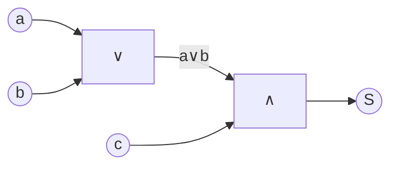

$$S(a,b,c) = abc \oplus ac \oplus bc, \qquad m=2.$$
### План
 
1. **Алгебраически упростить** $S$, используя свойства XOR: $x\oplus x=0,\ x\oplus 1=\bar x,$ дистрибутивность AND по XOR: $x(y\oplus z)=xy\oplus xz$
2. Если упрощение даст представление через ∧/∨ с двумя бинарными операциями — этого достаточно, схема собирается тривиально.
3. **Проверить** результат по таблице истинности.
4. **Нарисовать СФЭ**: от входов к выходу; пересчитать число бинарных вентилей и убедиться, что $L(S)\le m=2$.
### Решение
 
**Шаг 1. Упрощение $S$.**
 
Выношу $ac$ из первых двух слагаемых (дистрибутивность AND по XOR):
 
$$abc \oplus ac \;=\; ac\cdot b \oplus ac\cdot 1 \;=\; ac(b\oplus 1) \;=\; ac\bar b \;=\; a\bar b c.$$
 
Получаю $\;S = a\bar b c \,\oplus\, bc.\;$
 
Слагаемые $a\bar b c$ и $bc$ **не пересекаются** ($a\bar b c$ требует $b=0$, $bc$ требует $b=1$), значит на любом наборе сразу обе единицы не возникают, и XOR совпадает с дизъюнкцией:
 
$$S \;=\; a\bar b c \,\lor\, bc \;=\; c(a\bar b \lor b) \;=\; c(a\lor b).$$
 
(Использовал тождество $b\lor a\bar b = b\lor a$ — частный случай $x\lor \bar x y = x\lor y$.)
 
**Шаг 2. Проверка по таблице истинности.**
 
| $a$ | $b$ | $c$ | $abc$ | $ac$ | $bc$ | $abc\oplus ac\oplus bc$ | $c(a\lor b)$ |
| :-: | :-: | :-: | :---: | :--: | :--: | :---------------------: | :----------: |
|  0  |  0  |  0  |   0   |  0   |  0   |            0            |      0       |
|  0  |  0  |  1  |   0   |  0   |  0   |            0            |      0       |
|  0  |  1  |  0  |   0   |  0   |  0   |            0            |      0       |
|  0  |  1  |  1  |   0   |  0   |  1   |            1            |      1       |
|  1  |  0  |  0  |   0   |  0   |  0   |            0            |      0       |
|  1  |  0  |  1  |   0   |  1   |  0   |            1            |      1       |
|  1  |  1  |  0  |   0   |  0   |  0   |            0            |      0       |
|  1  |  1  |  1  |   1   |  1   |  1   |    $1\oplus1\oplus1=1$  |      1       |
 
Все 8 строк совпали. ✓
 
**Шаг 3. Построение СФЭ.**
 
Формула $S=c\cdot(a\lor b)$ даёт два бинарных вентиля:
 
- $E_1$: $\;g_1 = a\lor b\;$ — элемент **∨** (вход: $a,b$);
- $E_2$: $\;S = c\land g_1\;$ — элемент **∧** (вход: $c$ и выход $E_1$).
Отрицания не используются вообще; **сложность $L(S)=2 \le m=2$** ✓.
 
**Схема:**
 

 
Текстом:
 
$$
a,\,b \;\longrightarrow\;\boxed{\;\vee\;}\;\longrightarrow\;(a\lor b)\;\longrightarrow\;\boxed{\;\wedge\;}\;\longrightarrow\; S, \qquad c\;\longrightarrow\;\boxed{\;\wedge\;}
$$
 
**Ответ.** $\;S = c(a\lor b),\;$ СФЭ из двух элементов ($\lor$ и $\land$), $L(S)=2$.
 