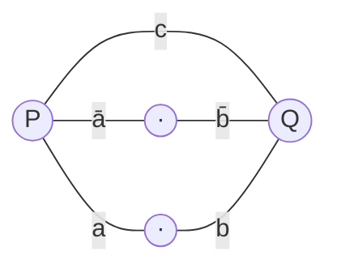

$$R(a,b,c) \;=\; ab \,\lor\, a\bar b c \,\lor\, \bar a b c \,\lor\, \bar a\bar b.$$
### План
 
1. Упростить $R$ алгебраически или через карту Карно — длинная формула обычно поддаётся минимизации, а от этого напрямую зависит число контактов.
2. Проверить упрощение по таблице истинности.
3. По полученной минимальной ДНФ построить **параллельно-последовательную** РКС: дизъюнкция → параллельные ветви между двумя полюсами; конъюнкция в ветви → последовательно соединённые контакты.
4. Подсчитать число контактов.
### Решение
 
**Шаг 1. Таблица истинности и карта Карно.**
 
| $a$ | $b$ | $c$ | $ab$ | $a\bar b c$ | $\bar a b c$ | $\bar a\bar b$ | $R$ |
| :-: | :-: | :-: | :--: | :---------: | :----------: | :------------: | :-: |
|  0  |  0  |  0  |  0   |      0      |      0       |       1        |  1  |
|  0  |  0  |  1  |  0   |      0      |      0       |       1        |  1  |
|  0  |  1  |  0  |  0   |      0      |      0       |       0        |  0  |
|  0  |  1  |  1  |  0   |      0      |      1       |       0        |  1  |
|  1  |  0  |  0  |  0   |      0      |      0       |       0        |  0  |
|  1  |  0  |  1  |  0   |      1      |      0       |       0        |  1  |
|  1  |  1  |  0  |  1   |      0      |      0       |       0        |  1  |
|  1  |  1  |  1  |  1   |      0      |      0       |       0        |  1  |
 
Карта Карно ($a$ — строки, $bc$ — столбцы в коде Грея):
 
| $a\backslash bc$ | **00** | **01** | **11** | **10** |
| :--------------: | :----: | :----: | :----: | :----: |
|     **0**        |   1    |   1    |   1    |   0    |
|     **1**        |   0    |   1    |   1    |   1    |
 
**Шаг 2. Группы.**
 
- Столбцы $bc=01$ и $bc=11$ (обе строки) — это весь столбец $c=1$: импликанта $c$ (покрывает 001, 011, 101, 111).
- Клетка 000 — не покрыта $c$; склеивается с 001: импликанта $\bar a\bar b$ (покрывает 000, 001).
- Клетка 110 — не покрыта; склеивается с 111: импликанта $ab$ (покрывает 110, 111).
Каждая из трёх импликант обязательна: 000 покрыта только $\bar a\bar b$, 110 — только $ab$, а $c$ единственная покрывает 011 и 101.
 
$$\boxed{\,R(a,b,c) \;=\; c \,\lor\, \bar a\bar b \,\lor\, ab\,}$$
 
**Шаг 3. Сверка** (все 8 строк совпадают с исходной таблицей):
 
| $abc$ | $c$ | $\bar a\bar b$ | $ab$ | $R$ |
| :---: | :-: | :------------: | :--: | :-: |
| 000   |  0  |       1        |  0   |  1  |
| 001   |  1  |       1        |  0   |  1  |
| 010   |  0  |       0        |  0   |  0  |
| 011   |  1  |       0        |  0   |  1  |
| 100   |  0  |       0        |  0   |  0  |
| 101   |  1  |       0        |  0   |  1  |
| 110   |  0  |       0        |  1   |  1  |
| 111   |  1  |       0        |  1   |  1  |
 
Совпало. ✓
 
**Шаг 4. Построение РКС.**
 
Дизъюнкция трёх членов → **три параллельные ветви** между полюсами $P$ (вход) и $Q$ (выход):
 
- ветвь 1: один контакт $c$;
- ветвь 2: последовательно $\bar a$ и $\bar b$;
- ветвь 3: последовательно $a$ и $b$.
**Число контактов: $1 + 2 + 2 = 5$.**
 
