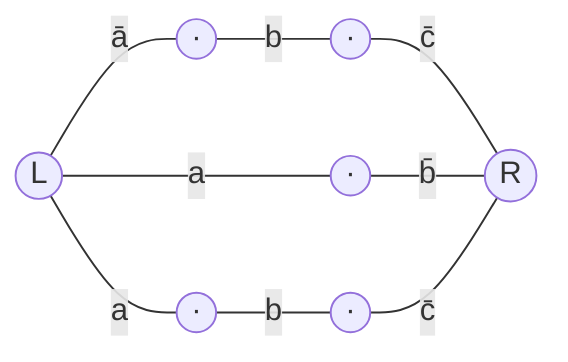

$$\sigma(a,b,c) \;=\; (a\to b)\,|\,(b\to c), \qquad \text{разложение по }(a,b).$$
 
> $x\to y = \bar x\lor y$; $\;x\,|\,y = \overline{xy} = \bar x\lor\bar y$ (штрих Шеффера).
 
### План
 
1. Привести $\sigma$ к удобному виду и/или составить таблицу истинности.
2. По формуле Шеннона для разложения по двум переменным:
   $$\sigma(a,b,c) \;=\; \bar a\bar b\cdot \sigma(0,0,c) \;\lor\; \bar a b\cdot \sigma(0,1,c) \;\lor\; a\bar b\cdot \sigma(1,0,c) \;\lor\; ab\cdot \sigma(1,1,c)$$
   вычислить четыре кофактора по $c$.
3. По разложению построить РКС из четырёх параллельных ветвей: префикс из двух контактов $a/\bar a$, $b/\bar b$, затем подсхема для кофактора $\sigma_{\alpha\beta}(c)$. Кофактор $0$ → ветка вырезается; кофактор $1$ → подсхема заменяется проводом.
4. Подсчитать контакты, проверить итог.
### Решение
 
**Шаг 1. Таблица истинности.**
 
| $a$ | $b$ | $c$ | $a\to b$ | $b\to c$ | $\sigma=\overline{(a\to b)(b\to c)}$ |
| :-: | :-: | :-: | :------: | :------: | :----------------------------------: |
|  0  |  0  |  0  |    1     |    1     |                  0                   |
|  0  |  0  |  1  |    1     |    1     |                  0                   |
|  0  |  1  |  0  |    1     |    0     |                  1                   |
|  0  |  1  |  1  |    1     |    1     |                  0                   |
|  1  |  0  |  0  |    0     |    1     |                  1                   |
|  1  |  0  |  1  |    0     |    1     |                  1                   |
|  1  |  1  |  0  |    1     |    0     |                  1                   |
|  1  |  1  |  1  |    1     |    1     |                  0                   |
 
**Шаг 2. Кофакторы по $c$.**
 
Фиксируем $a,b$ и читаем столбец $\sigma$ по двум строкам $c=0,1$:
 
| $\alpha\beta$ | $\sigma(\alpha,\beta,0)$ | $\sigma(\alpha,\beta,1)$ |        $\sigma_{\alpha\beta}(c)$        |
| :-----------: | :----------------------: | :----------------------: | :-------------------------------------: |
|      00       |            0             |            0             |                  $0$                    |
|      01       |            1             |            0             |               $\bar c$                  |
|      10       |            1             |            1             |                  $1$                    |
|      11       |            1             |            0             |               $\bar c$                  |
 
Разложение Шеннона:
 
$$\sigma \;=\; \bar a\bar b\cdot 0 \;\lor\; \bar a b\cdot \bar c \;\lor\; a\bar b\cdot 1 \;\lor\; ab\cdot \bar c \;=\; \bar a b\bar c \,\lor\, a\bar b \,\lor\, ab\bar c.$$
 
Сверка с таблицей — совпадает на всех 8 наборах. ✓
 
**Шаг 3. РКС.**
 
Каноническая структура: четыре параллельные ветви между полюсами $L$ и $R$, у каждой — префикс из двух контактов $a/\bar a, b/\bar b$ и блок кофактора по $c$.
 
| Ветвь | Префикс по $a,b$ | Кофактор $\sigma_{\alpha\beta}(c)$ | Содержимое                       |
| :---: | :--------------: | :--------------------------------: | :------------------------------- |
|   1   | $\bar a, \bar b$ |                $0$                 | вырезается (постоянный разрыв)   |
|   2   | $\bar a, b$      |             $\bar c$               | контакт $\bar c$                 |
|   3   | $a, \bar b$      |                $1$                 | сплошной провод (никакого блока) |
|   4   | $a, b$           |             $\bar c$               | контакт $\bar c$                 |
 
Остаются **3 параллельные ветви**:
 
- ветвь 2: $\bar a \to b \to \bar c$ (3 контакта последовательно);
- ветвь 3: $a \to \bar b$ (2 контакта);
- ветвь 4: $a \to b \to \bar c$ (3 контакта).
**Общее число контактов: $3 + 2 + 3 = 8$.**
 

  
---