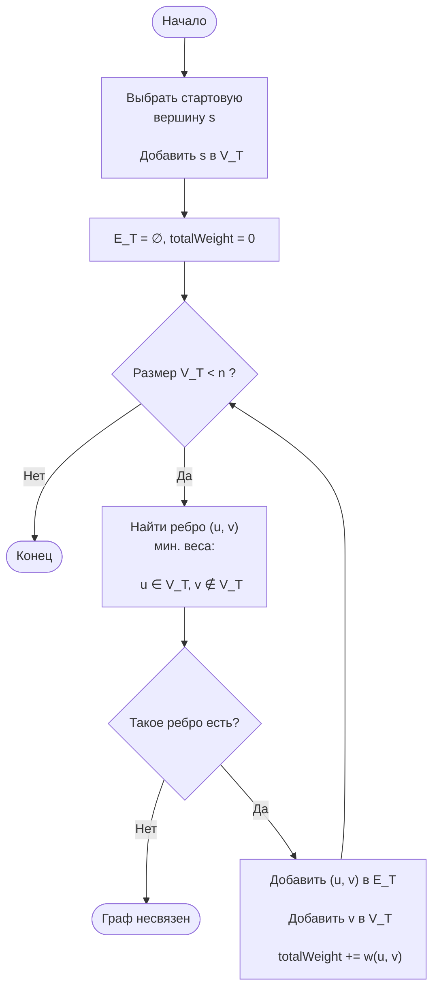
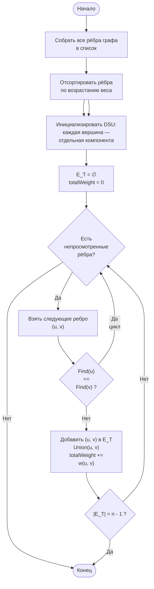

# ОТВЕТ: 143


При решении задачи мне вспомнилось, что в последней задачи параллельной дисциплины рассматривался метод Union-Find основанный на системах непересекающихся множеств. В описании типовых применений которого значилось: 
"Дан неориентированный связный граф со взвешенными ребрами. Выкинуть из него некоторые ребра так, чтобы в итоге получилось дерево, причем суммарный вес ребер этого дерева должен быть наименьшим". Поэтому я позволил себе выполнить задачу в коде на языке C#, приложив к своему решению блок-схемы алгоритмов и чуть более подробное пояснение к алгоритму Union-Find.

---
# Алгоритм прима

---
# Алгоритм Краскала

# Рабочий код программы:
```csharp
int?[,] matrix = new int?[,]
{
    //    X1   X2   X3   X4   X5  X6   X7   X8
    {  null, null,    1, null,    6, null, null,   20 },  // X1
    {  null, null,   49, null, null, null,    5, null },  // X2
    {     1,   49, null, null,   13,   45,   50,   79 },  // X3
    {  null, null, null, null,   25,   72,   85, null },  // X4
    {     6, null,   13,   25, null,   37, null, null },  // X5
    {  null, null,   45,   72,   37, null, null, null },  // X6
    {  null,    5,   50,   85, null, null, null, null },  // X7
    {    20, null,   79, null, null, null, null, null }   // X8
};

int resultPrim = Prim(matrix);       // ответ: 143
int resultKruskal = Kruskal(matrix); // ответ: 143

static int Prim(int?[,] matrix)
{
    int n = matrix.GetLength(0);
    bool[] visited = new bool[n];
    int totalWeight = 0;
    visited[0] = true; // стартуем с X1
    for (int step = 1; step < n; step++)
    {
        int bestU = -1, bestV = -1;
        int? bestW = null;

        // Ищем минимальное ребро: из посещённой вершины в непосещённую
        for (int u = 0; u < n; u++)
        {
            if (!visited[u]) continue;

            for (int v = 0; v < n; v++)
            {
                if (visited[v]) continue;
                if (!matrix[u, v].HasValue) continue;

                if (bestW == null || matrix[u, v] < bestW)
                {
                    bestW = matrix[u, v];
                    bestU = u;
                    bestV = v;
                }
            }
        }
        visited[bestV] = true;
        totalWeight += bestW!.Value;
    }
    return totalWeight;
}

static int Kruskal(int?[,] matrix)
{
    int n = matrix.GetLength(0);

    // Собираем все рёбра (верхний треугольник)
    var edges = new List<(int weight, int u, int v)>();
    for (int i = 0; i < n; i++)
        for (int j = i + 1; j < n; j++)
            if (matrix[i, j].HasValue)
                edges.Add((matrix[i, j]!.Value, i, j));

    // Сортируем по весу
    edges.Sort((a, b) => a.weight.CompareTo(b.weight));

    // DSU (Union-Find)
    int[] parent = [.. Enumerable.Range(0, n)];
    int[] rank   = new int[n];

    int Find(int x) =>
        parent[x] == x ? x : parent[x] = Find(parent[x]);

    bool Union(int x, int y)
    {
        int px = Find(x), py = Find(y);
        if (px == py) return false;

        if (rank[px] < rank[py]) (px, py) = (py, px);
        parent[py] = px;
        if (rank[px] == rank[py]) rank[px]++;
        return true;
    }

    // Строим остов
    int totalWeight = 0;
    
    foreach (var (weight, u, v) in edges)
    {
        if (Union(u, v))
        {
            totalWeight += weight;
        }
    }
    return totalWeight;

}
```

# Union-Find (DSU - Disjoint Set Union)

> полная версия: [здесь](https://github.com/MarkPatka/MyObsidianVault/blob/main/1.%20IT-Engineering/1.%20Computer%20Science/1.%20Algorithms%20%26%20Data%20Structures/Searching%20Algorithms/Union-Find%20(DSU%20-%20Disjoint%20Set%20Union).md)

  

Поставим перед собой следующую задачу. Пускай мы оперируем элементами **N** видов (для простоты, здесь и далее — числами от 0 до N-1). Некоторые группы чисел объединены в множества. Также мы можем добавить в структуру новый элемент, он тем самым образует множество размера 1 из самого себя. И наконец, периодически некоторые два множества нам потребуется сливать в одно.  

Формализуем задачу:

> создать _быструю_ структуру, которая поддерживает следующие операции:  

- **MakeSet(X)** — внести в структуру новый элемент X, создать для него множество размера 1 из самого себя.  

- **Find(X)** — возвратить _идентификатор_ множества, которому принадлежит элемент X.

    В качестве идентификатора мы будем выбирать один элемент из этого множества — _представителя_ множества. Гарантируется, что для одного и того же множества представитель будет возвращаться один и тот же, иначе невозможно будет работать со структурой: не будет корректной даже проверка принадлежности двух элементов одному множеству `if (Find(X) == Find(Y))`.  

- **Unite(X, Y)** — объединить два множества, в которых лежат элементы X и Y, в одно новое.  


```csharp

public class DSU

{

    private readonly int[] _parent;

    private readonly int[] _rank;

  

    public DSU(int n)

    {

        _parent = new int[n];

        _rank = new int[n];

        for (int i = 0; i < n; i++)

            MakeSet(i);

    }

  

    // каждый элемент сам себе корень

    public void MakeSet(int x)

    {

        _parent[x] = x;

        _rank[x] = 0;

    }

  

    // поиск корня со сжатием пути

    public int Find(int x)

    {

        if (_parent[x] == x) return x;

        return _parent[x] = Find(_parent[x]); // path compression

    }

  

    // слияние по рангу

    public void Unite(int x, int y)

    {

        x = Find(x);

        y = Find(y);

  

        if (x == y) return; // уже в одной группе

  

        // подвешиваем меньшее дерево к большему

        if (_rank[x] < _rank[y])

            _parent[x] = y;

        else

        {

            _parent[y] = x;

            if (_rank[x] == _rank[y])

                _rank[x]++;

        }

    }

}

```