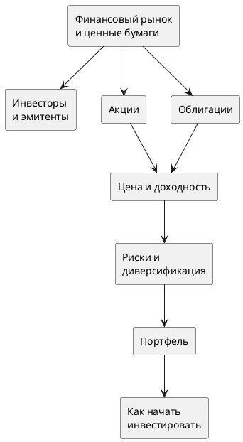

# 📈 Основы фондового рынка

Конспекты по курсу «Фондовый рынок, ценные бумаги, инвесторы и эмитенты».

## Содержание

| Тема                                      | Файл                                             |
| ----------------------------------------- | ------------------------------------------------ |
| Финансовый рынок и ценные бумаги          | [[2. Финансовый рынок и ценные бумаги]]          |
| Инвесторы, эмитенты и цены акций          | [[3. Инвесторы, эмитенты и цены акций]]          |
| Цена и доходность финансовых инструментов | [[4. Цена и доходность финансовых инструментов]] |
| Риски и диверсификация портфеля           | [[5. Риски и диверсификация портфеля]]           |
| Как начать инвестировать                  | [[6. Как начать инвестировать]]                  |

---

## Карта связей

