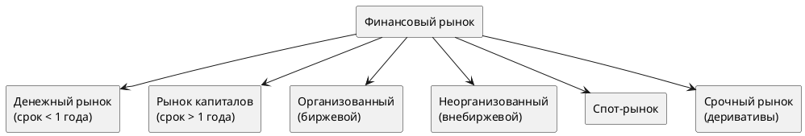
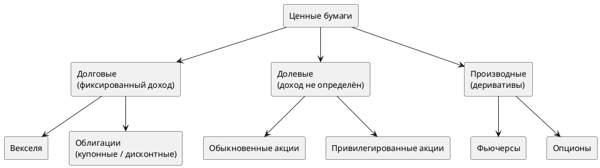
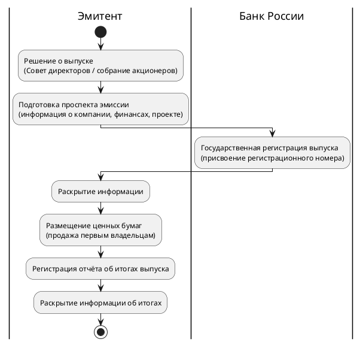

# Финансовый рынок и ценные бумаги

## 1. Что такое финансовый рынок

**Финансовый рынок** — совокупность институтов и механизмов для рыночного перераспределения денежных капиталов между теми, у кого деньги есть («продавцами денег»), и теми, кто в них нуждается («покупателями денег»).

На финансовом рынке «товаром» являются деньги. Банк выступает посредником и берёт за это маржу (~5%). Ценные бумаги позволяют обойти банк и снизить стоимость заимствования для эмитента, одновременно повышая доходность для инвестора.

### 1.1 Структура финансового рынка

### 1.2 Банк vs Ценные бумаги

| | Банковский кредит | Облигации |
|---|---|---|
| Посредник | Банк (берёт маржу ~5%) | Не нужен |
| Срок | Редко > 5 лет | 5–30+ лет |
| Доступность | Ограничена нормативами ЦБ | Широкий круг инвесторов |
| Досрочный возврат | Потеря процентов | Продажа на бирже в любой день с сохранением НКД |

---

## 2. Ценные бумаги

**Ценные бумаги** — документы, подтверждающие финансовые отношения между владельцем (инвестором) и организацией, выпустившей их (эмитентом). Формальное определение — ст. 142 ГК РФ.

### 2.1 Классификация по инвестиционным качествам

### 2.2 Эмиссионные vs Неэмиссионные

**Эмиссионные** — выпускаются крупными партиями, все бумаги внутри выпуска идентичны, обязательна государственная регистрация. Основные виды: акции и облигации.

**Неэмиссионные** — выпускаются единично или малыми партиями, не подлежат госрегистрации. Примеры: векселя, чеки, коносаменты, складские свидетельства.

---

## 3. Облигации

**Облигация** — безусловное долговое обязательство, по которому эмитент обязуется выплатить номинал и купонный доход в установленные сроки. Мобилизованный таким способом капитал — одна из форм займа.

### 3.1 Обязательные элементы

- **Номинал (par value)** — сумма, выплачиваемая при погашении
- **Дата погашения (maturity date)** — день возврата номинала и прекращения выплат
- **Купон** — процентный доход в виде % от номинала

### 3.2 Виды по способу формирования дохода

| Вид | Доход | Когда выплачивается |
|-----|-------|---------------------|
| **Купонные** | % от номинала (фиксированный или плавающий) | Периодически (раз в год, раз в полгода) |
| **Дисконтные (бескупонные)** | Разница между ценой покупки и номиналом | Целиком при погашении |

> Пример: облигация номиналом **1 000 руб.**, купон 12% годовых, выплата 2 раза в год → купонная выплата = 1 000 × 12% × 0,5 = **60 руб.** каждые полгода.

### 3.3 Преимущества облигаций для инвестора vs депозит

- Доходность выше, чем у банковских депозитов
- **Высокая ликвидность** — продажа в любой рабочий день на бирже с сохранением НКД
- Можно продать только часть пакета, не теряя накопленный доход

### 3.4 Преимущества для эмитента

- Нет банковской маржи — стоимость заимствования ниже
- Более длинные сроки (5, 10, 30+ лет), чем у банковских кредитов
- Можно привлечь крупные суммы от множества мелких инвесторов (номинал большинства российских облигаций — 1 000 руб.)
- Независимость от конкретного банка

---

## 4. Акции

**Акция** — бессрочная эмиссионная ценная бумага, выпускаемая только акционерными обществами. Закрепляет права владельца на:
- получение части прибыли в виде **дивидендов**
- участие в управлении АО (голосование на собрании)
- часть имущества при ликвидации

| | Обыкновенные | Привилегированные |
|---|---|---|
| Право голоса | ✅ | ❌ (кроме особых случаев) |
| Дивиденды | По решению совета директоров | Как правило выше и фиксированные |
| Доля в УК | Не ограничена | Не более 25% от уставного капитала |

---

## 5. Участники фондового рынка

| Участник | Роль |
|----------|------|
| **Эмитенты** | Выпускают ценные бумаги, привлекают капитал |
| **Инвесторы** | Покупают ценные бумаги, «продают» деньги |
| **Брокеры** | Совершают сделки от имени и за счёт клиентов |
| **Дилеры (маркет-мейкеры)** | Объявляют твёрдые цены покупки/продажи, заключают сделки за свой счёт |
| **Доверительный управляющий** | Управляет средствами клиента по договору ДУ |
| **Депозитарий** | Учёт и хранение ценных бумаг на счетах-депо |
| **Регистратор** | Ведение реестра владельцев ценных бумаг |
| **Биржа** | Организует торги, предоставляет инфраструктуру |
| **Клиринговая палата** | Рассчитывает взаимные обязательства участников |
| **Расчётный банк** | Хранит денежные средства и проводит расчёты |

### 5.1 Первичный и вторичный рынок

- **Первичный рынок** — компания продаёт ценные бумаги первым владельцам. Именно здесь эмитент привлекает финансирование.
- **Вторичный рынок** — инвесторы торгуют между собой. Здесь формируется рыночная цена и капитализация компании.

### 5.2 Этапы эмиссии ценных бумаг

---

## Связанные заметки

- [[3. Инвесторы, эмитенты и цены акций]]
- [[4. Цена и доходность финансовых инструментов]]
- [[5. Риски и диверсификация портфеля]]
