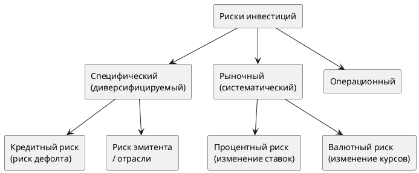
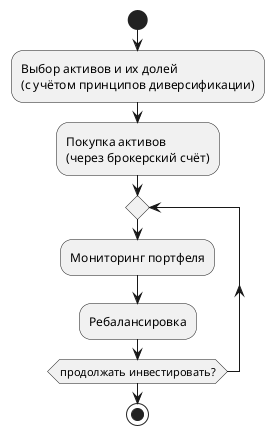

# Риски и диверсификация портфеля

## 1. Виды рисков на фондовом рынке

**Риск** на фондовом рынке — неопределённость будущих доходов. Основное проявление — **волатильность** (изменчивость) рыночных цен.

| Вид риска | Описание | Устраняется диверсификацией? |
|-----------|----------|------------------------------|
| **Специфический** | Риск конкретного эмитента: авария, банкротство, скандал | ✅ Да |
| **Рыночный (систематический)** | Влияет на всех участников: кризис, изменение ставок ЦБ | ❌ Нет |
| **Операционный** | Ошибки процессов, мошенничество | Частично |

> [!info] Компромисс риск / доходность
> Инвестор, желающий повысить доходность, вынужден принять более высокий уровень риска. И наоборот — снижение риска неизбежно снижает ожидаемую доходность.

---

## 2. Кредитные рейтинги

Кредитный рейтинг — экспертная оценка **вероятности дефолта** эмитента. Основные агентства: S&P, Fitch, Moody's.

| S&P / Fitch | Moody's | Характеристика | Класс |
|-------------|---------|----------------|-------|
| AAA | Aaa | Высшее качество | Инвестиционный |
| AA | Aa | Очень хорошее качество | Инвестиционный |
| A | A | Хорошее качество | Инвестиционный |
| BBB | Baa | Среднее, высокая платёжеспособность | Инвестиционный |
| BB | Ba | Ниже среднего, слабое покрытие долга | Спекулятивный |
| B | B | Плохое качество, нет покрытия долга | Спекулятивный |
| CCC–C | Caa–C | Высокая вероятность дефолта | Мусорные |
| D | — | Дефолт | — |

> [!warning] Помни о компромиссе
> Высокий рейтинг = низкий риск = **низкая доходность**. «Мусорные» облигации могут дать сверхприбыль при выходе эмитента из кризиса, но несут высокий риск полной потери капитала.

---

## 3. Диверсификация

**Диверсификация** — распределение капитала между несколькими активами для снижения суммарного риска портфеля. Идея: доходы по одним активам компенсируют убытки по другим.

Диверсификация снижает только **специфический** риск. Рыночный риск при любом количестве активов остаётся.

### 3.1 Роль корреляции доходностей

Коэффициент парной корреляции $\rho$ показывает, насколько синхронно движутся доходности двух активов ($-1 \leq \rho \leq +1$):

| $\rho$ | Смысл | Эффект диверсификации |
|--------|-------|----------------------|
| $+1{,}0$ | Движутся строго одинаково | Отсутствует |
| $0$ | Независимы | Частичное снижение риска |
| $-1{,}0$ | Движутся строго в противофазе | Максимальный — при правильных долях риск = **0** |

> [!tip] Практический вывод
> Чем ниже $\rho$ между активами — тем эффективнее диверсификация. В идеале подбирать активы, которые ведут себя по-разному в одних и тех же рыночных условиях.

### 3.2 Базовые принципы диверсификации

1. Вкладывать в **разные классы активов**: акции, облигации, валюта, товарные контракты
2. Среди акций — компании **разных отраслей** и стран
3. Среди облигаций — **разные сроки** и уровни кредитного рейтинга
4. Каждый актив должен быть **ликвидным** — продаваться быстро без значительной потери в цене

---

## 4. Формирование инвестиционного портфеля

### 4.1 Основные этапы

### 4.2 Стратегии ребалансировки

С течением времени доли активов смещаются из-за изменения цен. Ребалансировка — восстановление исходной структуры.

**Пассивная стратегия** (рекомендуется новичкам):
- Проводить раз в год
- Продавать подорожавшие активы, докупать подешевевшие
- Цель: поддержание постоянного уровня риска

**Активная стратегия**:
- Руководствоваться анализом и прогнозами
- На длинных горизонтах активные инвесторы **редко** превосходят пассивных

> [!example] Пример базовой структуры портфеля для новичка
> - 40% — акции российских компаний
> - 40% — облигации российских эмитентов
> - 20% — иностранная валюта

---

## Связанные заметки

- [[2. Финансовый рынок и ценные бумаги]]
- [[4. Цена и доходность финансовых инструментов]]
- [[6. Как начать инвестировать]]
