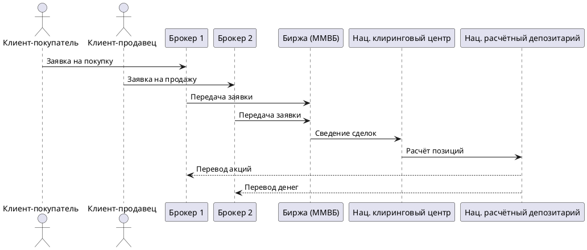

# Как начать инвестировать

## 1. Инфраструктура фондового рынка

Чтобы купить ценную бумагу на бирже, сделка проходит через цепочку профессиональных участников:

---

## 2. Первые шаги: как открыть счёт

### 2.1 Выбор брокера

Брокер — профессиональный участник, представляющий интересы инвестора на бирже. Без него биржевые сделки невозможны. Нужно:
- Заключить **договор на брокерское обслуживание**
- Открыть **счёт депо** в депозитарии брокера
- Зачислить деньги на торговый счёт

Крупные российские брокеры: Т-Банк, Сбер, ВТБ, Альфа-Банк, БКС, Финам.

### 2.2 Торговый терминал QUIK

Популярная платформа для онлайн-торговли на Московской бирже. Основные элементы:

- **Список котировок** — текущие цены спроса/предложения
- **«Биржевой стакан»** — очередь заявок на покупку (зелёные) и продажу (красные), ранжированная по цене
- **График цены и объёма** — для выбора момента входа/выхода
- **Отчёт брокера** — ежедневный документ с состоянием портфеля и историей сделок

> [!tip] Типы заявок
> - **Рыночная** — исполняется немедленно по лучшей доступной цене
> - **Лимитная** — исполняется только при достижении указанной цены; до этого стоит в стакане в очереди

> [!note] Демо-счёт
> Начинающим рекомендуется сначала поработать на **демо-счёте** — полноценном симуляторе без реальных денег. Предоставляет любой крупный брокер бесплатно.

---

## 3. Индивидуальный инвестиционный счёт (ИИС)

**ИИС** — специальный брокерский счёт с налоговыми льготами. Регулируется ст. 10.2-1 ФЗ «О рынке ценных бумаг».

Условия:
- Один гражданин РФ (с 18 лет) — не более **одного ИИС**
- Минимальный срок: **3 года**
- Пополнение: не более **1 млн руб./год**
- Доступные инструменты: акции и облигации российских эмитентов, ПИФ, иностранные бумаги через российские биржи, производные инструменты

### 3.1 Типы налоговых вычетов

| | Тип А | Тип Б |
|--|-------|-------|
| **Суть** | Возврат НДФЛ с официального дохода (зарплаты) | Освобождение от НДФЛ на прибыль по ИИС |
| **Максимум** | 52 000 руб./год (13% от 400 000 руб.) | Не ограничен |
| **Когда выгоден** | Есть белая зарплата, небольшая торговая прибыль | Активная торговля, большая прибыль |
| **Где оформить** | Налоговая инспекция (ИФНС) | У брокера или в ИФНС |

> [!warning] Важные ограничения ИИС
> - Нельзя совмещать оба типа вычетов в одном ИИС
> - Досрочный вывод денег (раньше 3 лет) → **утрата всех льгот** и возврат уже полученных вычетов
> - С 2021 г.: вычет типа А применяется только к доходам основной налоговой базы (зарплата), но **не** к доходам от торговли ЦБ на обычном брокерском счёте

---

## 4. Налогообложение операций с ценными бумагами

| Вид дохода | Ставка НДФЛ | Налоговый агент |
|------------|-------------|-----------------|
| Дивиденды по акциям | 13% | Эмитент или депозитарий |
| Доход от продажи ЦБ / погашения с дисконтом | 13% | Брокер |
| Купоны по ОФЗ и корп. облигациям | 0% (с 2021 г.) | — |
| Купоны корп. облигаций 2017–2020 гг. (если > ставка ЦБ + 5 пп) | 35% с превышения | Брокер |

---

## 5. Паевые инвестиционные фонды (ПИФ)

**ПИФ** — обособленный имущественный комплекс под управлением профессиональной УК. Не является юр. лицом. Инвестор получает **инвестиционный пай** — долю в имуществе фонда.

$$P_{ст} = \frac{ЧА}{K}, \quad \text{где } ЧА = А - П$$

| Тип ПИФ | Режим работы | Особенность |
|---------|--------------|-------------|
| **Открытый** | Купить/продать в любой рабочий день | Самый ликвидный |
| **Интервальный** | В установленные периоды (≥ раза в год) | Обычно 4 раза в год по 2 недели |
| **Закрытый** | Вход на старте, выход на финише | Для конкретных проектов. Владельцы участвуют в собраниях |

> [!info] Преимущества коллективных инвестиций
> ПИФ решает главные проблемы мелкого инвестора: профессиональное управление, готовая диверсификация, снижение транзакционных издержек — всё это недоступно при самостоятельной работе с небольшим капиталом.

---

## 6. Пошаговый план для новичка

- [ ] Изучить основы: [[2. Финансовый рынок и ценные бумаги]], [[5. Риски и диверсификация портфеля]]
- [ ] Выбрать брокера, сравнив тарифы комиссий
- [ ] Открыть ИИС, выбрать тип вычета (А или Б)
- [ ] Потренироваться на **демо-счёте**
- [ ] Сформировать диверсифицированный портфель: акции + облигации + валюта
- [ ] Проводить **ребалансировку раз в год**

---

## Связанные заметки

- [[2. Финансовый рынок и ценные бумаги]]
- [[3. Инвесторы, эмитенты и цены акций]]
- [[5. Риски и диверсификация портфеля]]
