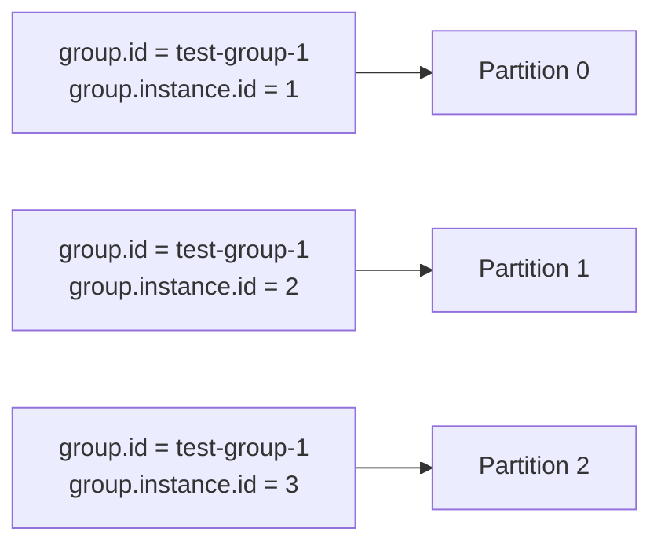
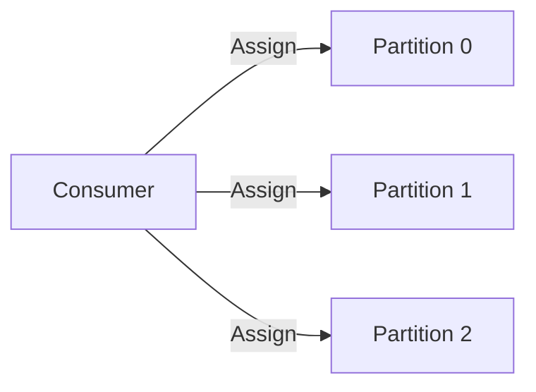

### Что такое Kafka?
---
**Kafka** – это платформа (*распределенного лога*) для потоков данных, которая используется для построения высоконагруженных решений и обработки данных в реальном времени. 
	**Распределенный лог** — это система, предназначенная для хранения и управления логами (журналами) событий, происходящих в распределенных системах. Он позволяет собирать, хранить и анализировать данные о событиях, происходящих на различных узлах сети, обеспечивая высокую доступность и отказоустойчивость.

### Каковы ключевые компоненты Kafka?
---
Ключевые компоненты Kafka включают:
- [[4.2. Producers (Производители)|Producer]]: Публикует сообщения в темы (*topics*) Kafka.
- [[4.3. Consumers (Потребители)|Consumer]]: Подписывается на темы и обрабатывает опубликованные сообщения.
- [[4.1. Brokers (Брокеры)|Broker]]: Сервер Kafka, который хранит и управляет топиками.
- [[4.7. Zookeeper|Zookeeper или KRaft]]: Управляет и координирует брокеры Kafka.
- [[4.4. Topics (Темы)|Topic]]: Категория или имя потока, в который публикуются записи.
- [[4.5. Partitions (Разделы)|Partition]]: Темы делятся на разделы для масштабируемости.

### Как Kafka обеспечивает отказоустойчивость?
---
Kafka обеспечивает отказоустойчивость за счет репликации данных. Каждый раздел (*partition*) реплицируется на настраиваемом количестве серверов (*brokers*) для обеспечения отказоустойчивости. Один из серверов назначается лидером, который обрабатывает все запросы на чтение и запись для раздела, в то время как остальные являются последователями, которые пассивно реплицируют лидера.
[[3. Kafka Key Concepts|см. подробнее в разделе "Репликация"]]

### В чем разница между consumer и consumer group?
---
Ключевое отличие заключается в том, что каждое сообщение доставляется **==только одному==** экземпляру потребителя в каждой подписывающей группе потребителей. Это позволяет осуществлять параллельную обработку и балансировку нагрузки при потреблении тем. 
Члены группы потребителей могут быть **статическими**, т.е. за определенным потребителем закрепляется конкретная партиция. Для этого используется
 `_group.instance.id_`  - параметр для закрепления  раздела (*partition*) за потребителем.


Для задач, в которых имеется единственный потребитель, который читает только из определенных партиций топика, можно не создавать новую группу, а просто назначить (*assign*) потребителю несколько партиций.

```csharp
consumer.Assign(new TopicPartitionOffset(messagesTopicPartition, new Offset(offsetMore.Value)));
```


Тем самым сформировав автономного потребителя. 
==Нельзя подписывать на партиции потребителя, уже состоящего в группе.==  

### Какова цель смещения (*offset*)?
---
**Offset** — это уникальный идентификатор записи в пределах раздела. Он обозначает позицию потребителя в разделе (partition). Kafka поддерживает это смещение для каждого раздела, для каждой группы потребителей, позволяя каждой группе потребителей читать с разной позиции в разделе. Это позволяет Kafka предоставлять как queue, так и publish-subscribe модели обмена сообщениями.
[[4.6. Segments (Сегменты)|Подробнее об offset в partition]]

### Как Kafka обрабатывает семантику доставки сообщений?
---

Kafka поддерживает три семантики доставки сообщений:

- **_at-most once_** означает, что при доставке сообщений нас устраивают потери сообщений, но не их дубликаты. Это самая слабая гарантия, которую реализуют брокерами очередей
- **_at-least once_** означает, что мы не хотим терять сообщения, но нас устраивают возможные дубликаты
- **_exactly-once_** означает, что мы хотим доставить одно и только одно сообщение, ничего не теряя и ничего не дублируя.
[[3. Kafka Key Concepts|Подробнее о семантиках доставки]]

### Какова роль Producer API?

API производителя Kafka используется для публикации потоков записей в темы Kafka. Он обрабатывает разбиение сообщений на разделы, сжатие и балансировку нагрузки между несколькими брокерами. Производитель также отвечает за повторные попытки неудачных попыток публикации и может быть настроен для различных уровней гарантий доставки.

[[4.2. Producers (Производители)|Подробнее о producer]]

### Как Kafka поддерживает масштабируемость?
---

Kafka поддерживает масштабируемость через партиционирование и распределенную обработку. Темы могут быть разделены на несколько брокеров, что позволяет выполнять параллельную обработку. Потребители могут быть сгруппированы для чтения из нескольких партиций одновременно. Брокеры могут быть добавлены в кластеры, а кластеры могут быть масштабированы без необходимости остановки работы.

### Что такое уплотнение логов (*log compaction*) в Kafka?

Уплотнение логов — это механизм, который обеспечивает более тонкую настройку хранения данных по записям, а не по времени. Идея заключается в том, чтобы выборочно удалять записи, для которых есть более актуальные с тем же первичным ключом. Таким образом, лог гарантирует наличие хотя бы последнего состояния для каждого ключа.

BEFORE COMPACTION:

| Offset | Key | Value |
|--------|-----|-------|
| 13     | K1  | V5    |
| 17     | K8  | V4    |
| 19     | K1  | V1    |
| 20     | K8  | V3    |
AFTER LOG COMPACTION:

| Offset | Key | Value |
| ------ | --- | ----- |
| 19     | K1  | V1    |
| 20     | K8  | V3    |

### Как Kafka обрабатывает порядок сообщений?
---

Kafka гарантирует порядок внутри партиции. Сообщения, отправленные продюсером в определенную партицию темы, будут добавлены в том порядке, в котором они были отправлены. Экземпляр потребителя будет читать записи в порядке их хранения в логе. Однако нет гарантии порядка между партициями.
[[4.5. Partitions (Разделы)|Подробнее о разделах]]
[[4.6. Segments (Сегменты)|Подробнее о размещении логов в партициях]]


### Чем важен параметр acks для producers? 
---

Параметр acks в продюсерах Kafka контролирует количество подтверждений, которые продюсер требует от лидера, прежде чем считать запрос завершенным. Это влияет на долговечность записей и может быть установлено на: 
- **0 (None)**: Без подтверждения 
- **1 (Leader)**: Только подтверждение от лидера 
- **-1 (All)**: Полное подтверждение от всех реплик (In-Sync Replica)
Это называется [[3. Kafka Key Concepts|Гарантией доставки]]


### Какие бывают стратегии партиционирования?
---
- **Стандартный партиционер (Default)**
- **Round-robin партиционер**
- **Равномерный "липкий" партиционер (Uniform Sticky)**
- **Пользовательский партиционер (Custom)**
[[4.5. Partitions (Разделы)|Подробнее о стратегиях]]

### Как установить пользовательскую стратегию партиционирования в .NET?
---
Используя библиотеку Confluent Kafka .NET (2.4 и новее)
```csharp
producerBuilder.SetDefaultPartitioner((string topicName, int partitionCount, 
	ReadOnlySpan<byte> keyData, bool keyIsNull) => 
{
	var keyString = System.Text.UTF8Encoding.UTF8.GetString(keyData.ToArray());
	return int.Parse(keyString.Split("").Last()) % partitionCount;
});
```

### Что такое data retention?

Kafka обрабатывает хранение данных через настраиваемые политики хранения. Они могут основываться на времени:

(TTL – time-to-live) Например, хранить данные в течение 7 дней. 
Задается через настройку segment timestamp expired --> to delete. 

Или на размере:
Например, хранить до 1 ГБ на партицию. 

После достижения предела хранения старые [[4.6. Segments (Сегменты)|сегменты партиций]] удаляются. Kafka также поддерживает *compaction* логов для тем, где требуется только последнее значение для каждого ключа.


### Какова цель API Kafka Connect?
---

[[4.8. Kafka Connect|Kafka Connect]] — это инструмент для масштабируемой и надежной передачи данных между Apache Kafka и другими системами данных. Он упрощает быстрое определение коннекторов, которые перемещают большие объемы данных в Kafka и из него. Может использоваться для подключения Kafka к базам данных, хранилищам ключ-значение, индексам поиска и файловым системам.


### Как Kafka обеспечивает высокую доступность?
--- 

Kafka обеспечивает высокую доступность через:

- [[3. Kafka Key Concepts|Репликацию]] партиций на нескольких брокерах;
- Автоматический выбор лидера при сбое брокера;
- Возможность добавления брокеров в кластер без простоя (downtime);
- Настраиваемое количество синхронных (ISN – in-sync replicas) реплик для долговечности;
- [[4.7. Zookeeper|ZooKeeper]]\KRaft для распределенной координации и управления брокерами

### Как Kafka обрабатывает сжатие сообщений?
---

**Kafka** поддерживает сжатие сообщений для уменьшения размера передаваемых и хранимых данных. Сжатие может быть настроено на уровне продюсера. Kafka поддерживает несколько типов сжатия, gzip, snappy, etc. Брокер может быть настроен на декомпрессию сообщений для проверки и преобразования их в версию формата сообщения на брокере. Сжатие выполняется после того, как определена партиция для сообщения, для этого используется *compression .codec*.

### Какова цель API Kafka Streams?

[[4.9. Kafka Streams|API Kafka Streams]] — это клиентская библиотека для создания приложений и микросервисов, которые обрабатывают и анализируют данные, хранящиеся в Kafka. Она позволяет создавать приложения для обработки потоков с использованием только стандартного Java и клиентов Kafka, без необходимости в отдельном кластере обработки. Она поддерживает операции с состоянием, оконные функции, объединение потоков и таблиц и многое другое.


### Как Kafka обрабатывает ограничения на размер сообщения?
---

Kafka имеет настраиваемые ограничения размера сообщений. Максимальный размер сообщения по умолчанию составляет 1MB. Он может быть увеличен, изменением параметра 'message.max.bytes' у брокера и  'max.request.size'у производителя. Больший размер сообщения оказывает негативное влияние на производительность.


### Дополнительные вопросы
---

1) Почему replication factor должен быть как минимум на единицу меньшим чем количество реплик? Почему нельзя сделать все реплики ISR? Как из-за этого может не выполниться запись данных в реплику?
2) Как происходит отправка сообщения в Kafka?
- Producer (send message) -> Происходит установка [[3. Kafka Key Concepts|гарантии доставки]] (acks 0 (none), 1 (leader) или -1 (all)) и [[3. Kafka Key Concepts|семантики доставки]] (at most once, at least once, exactly once (idempotence))
- Fetch metadata -> синхронная, блокирующая, дорогая операция (может занимать до 60 сек. по умолчанию), обращавшаяся к zookeeper (в ранних версиях), собирающая информацию о кластере и топике. ==Как это происходит в новых версиях с переходом на KRaft?==
- Serialize message -> у producer указывается key.serializer и value.serializer (например string serializer, если сообщение достаточно сериализовать просто в строку)
- Define partition -> explicit partition (явное указание партиции), автоматическое определение (round-robin: 0-1-2-3...), key-defined (key_hash % n) по ключу. 
- Compress message
- Accumulate batch (via batch.size and linger.ms) ==Если происходит накопление batch сообщениями, то что произойдет если брокер отвалится до записи этого batch?== отправка может быть осуществлена либо по превышении batch size, либо по достижении времени linger.ms, а также, если для одного брокера созданы 2 партиции и для каждой создан batch, и суммарный объем этих batch >= batch.size, происходит запись
- Запись bathes в Leader-партиции. 

