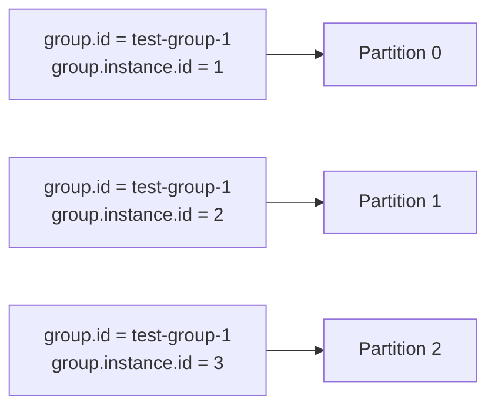
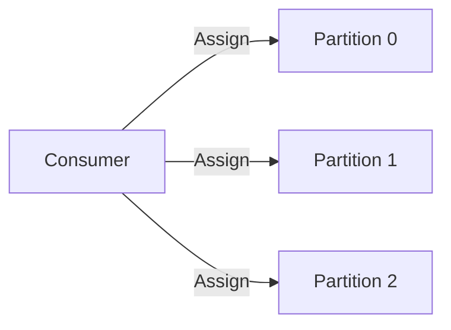

### Что такое Kafka?
---
**Kafka** – это платформа (*распределенного лога*) для потоков данных, которая используется для построения высоконагруженных решений и обработки данных в реальном времени. 
	**Распределенный лог** — это система, предназначенная для хранения и управления логами (журналами) событий, происходящих в распределенных системах. Он позволяет собирать, хранить и анализировать данные о событиях, происходящих на различных узлах сети, обеспечивая высокую доступность и отказоустойчивость.

### Каковы ключевые компоненты Kafka?
---
Ключевые компоненты Kafka включают:
- [[4.2. Producers (Производители)|Producer]]: Публикует сообщения в темы (*topics*) Kafka.
- [[4.3. Consumers (Потребители)|Consumer]]: Подписывается на темы и обрабатывает опубликованные сообщения.
- [[4.1. Brokers (Брокеры)|Broker]]: Сервер Kafka, который хранит и управляет топиками.
- [[4.7. Zookeeper|Zookeeper или KRaft]]: Управляет и координирует брокеры Kafka.
- [[4.4. Topics (Темы)|Topic]]: Категория или имя потока, в который публикуются записи.
- [[4.5. Partitions (Разделы)|Partition]]: Темы делятся на разделы для масштабируемости.

### Как Kafka обеспечивает отказоустойчивость?
---
Kafka обеспечивает отказоустойчивость за счет репликации данных. Каждый раздел (*partition*) реплицируется на настраиваемом количестве серверов (*brokers*) для обеспечения отказоустойчивости. Один из серверов назначается лидером, который обрабатывает все запросы на чтение и запись для раздела, в то время как остальные являются последователями, которые пассивно реплицируют лидера.
[[3. Kafka Key Concepts|см. подробнее в разделе "Репликация"]]

### В чем разница между consumer и consumer group?
---
Ключевое отличие заключается в том, что каждое сообщение доставляется **==только одному==** экземпляру потребителя в каждой подписывающей группе потребителей. Это позволяет осуществлять параллельную обработку и балансировку нагрузки при потреблении тем. 
Члены группы потребителей могут быть **статическими**, т.е. за определенным потребителем закрепляется конкретная партиция. Для этого используется
 `_group.instance.id_`  - параметр для закрепления  раздела (*partition*) за потребителем.


Для задач, в которых имеется единственный потребитель, который читает только из определенных партиций топика, можно не создавать новую группу, а просто назначить (*assign*) потребителю несколько партиций.

```csharp
consumer.Assign(new TopicPartitionOffset(messagesTopicPartition, new Offset(offsetMore.Value)));
```


Тем самым сформировав автономного потребителя. 
==Нельзя подписывать на партиции потребителя, уже состоящего в группе.==  

### Какова цель смещения (*offset*)?
---
**Offset** — это уникальный идентификатор записи в пределах раздела. Он обозначает позицию потребителя в разделе (partition). Kafka поддерживает это смещение для каждого раздела, для каждой группы потребителей, позволяя каждой группе потребителей читать с разной позиции в разделе. Это позволяет Kafka предоставлять как queue, так и publish-subscribe модели обмена сообщениями.
[[4.6. Segments (Сегменты)|Подробнее об offset в partition]]

### Как Kafka обрабатывает семантику доставки сообщений?
---

Kafka поддерживает три семантики доставки сообщений:

- **_at-most once_** означает, что при доставке сообщений нас устраивают потери сообщений, но не их дубликаты. Это самая слабая гарантия, которую реализуют брокерами очередей
- **_at-least once_** означает, что мы не хотим терять сообщения, но нас устраивают возможные дубликаты
- **_exactly-once_** означает, что мы хотим доставить одно и только одно сообщение, ничего не теряя и ничего не дублируя.
[[3. Kafka Key Concepts|Подробнее о семантиках доставки]]

### Какова роль Producer API?

API производителя Kafka используется для публикации потоков записей в темы Kafka. Он обрабатывает разбиение сообщений на разделы, сжатие и балансировку нагрузки между несколькими брокерами. Производитель также отвечает за повторные попытки неудачных попыток публикации и может быть настроен для различных уровней гарантий доставки.

[[4.2. Producers (Производители)|Подробнее о producer]]

### Как Kafka поддерживает масштабируемость?
---

Kafka поддерживает масштабируемость через партиционирование и распределенную обработку. Темы могут быть разделены на несколько брокеров, что позволяет выполнять параллельную обработку. Потребители могут быть сгруппированы для чтения из нескольких партиций одновременно. Брокеры могут быть добавлены в кластеры, а кластеры могут быть масштабированы без необходимости остановки работы.

### Что такое уплотнение логов (*log compaction*) в Kafka?

Уплотнение логов — это механизм, который обеспечивает более тонкую настройку хранения данных по записям, а не по времени. Идея заключается в том, чтобы выборочно удалять записи, для которых есть более актуальные с тем же первичным ключом. Таким образом, лог гарантирует наличие хотя бы последнего состояния для каждого ключа.

BEFORE COMPACTION:

| Offset | Key | Value |
|--------|-----|-------|
| 13     | K1  | V5    |
| 17     | K8  | V4    |
| 19     | K1  | V1    |
| 20     | K8  | V3    |
AFTER LOG COMPACTION:

| Offset | Key | Value |
| ------ | --- | ----- |
| 19     | K1  | V1    |
| 20     | K8  | V3    |

### Как Kafka обрабатывает порядок сообщений?
---

Kafka гарантирует порядок внутри партиции. Сообщения, отправленные продюсером в определенную партицию темы, будут добавлены в том порядке, в котором они были отправлены. Экземпляр потребителя будет читать записи в порядке их хранения в логе. Однако нет гарантии порядка между партициями.
[[4.5. Partitions (Разделы)|Подробнее о разделах]]
[[4.6. Segments (Сегменты)|Подробнее о размещении логов в партициях]]


### Чем важен параметр acks для producers? 
---

Параметр acks в продюсерах Kafka контролирует количество подтверждений, которые продюсер требует от лидера, прежде чем считать запрос завершенным. Это влияет на долговечность записей и может быть установлено на: 
- **0 (None)**: Без подтверждения 
- **1 (Leader)**: Только подтверждение от лидера 
- **-1 (All)**: Полное подтверждение от всех реплик (In-Sync Replica)
Это называется [[3. Kafka Key Concepts|Гарантией доставки]]


### Какие бывают стратегии партиционирования?
---
- **Стандартный партиционер (Default)**
- **Round-robin партиционер**
- **Равномерный "липкий" партиционер (Uniform Sticky)**
- **Пользовательский партиционер (Custom)**
[[4.5. Partitions (Разделы)|Подробнее о стратегиях]]

### Как установить пользовательскую стратегию партиционирования в .NET?
---
Используя библиотеку Confluent Kafka .NET (2.4 и новее)
```csharp
producerBuilder.SetDefaultPartitioner((string topicName, int partitionCount, 
	ReadOnlySpan<byte> keyData, bool keyIsNull) => 
{
	var keyString = System.Text.UTF8Encoding.UTF8.GetString(keyData.ToArray());
	return int.Parse(keyString.Split("").Last()) % partitionCount;
});
```

### Что такое data retention?

Kafka обрабатывает хранение данных через настраиваемые политики хранения. Они могут основываться на времени:

(TTL – time-to-live) Например, хранить данные в течение 7 дней. 
Задается через настройку segment timestamp expired --> to delete. 

Или на размере:
Например, хранить до 1 ГБ на партицию. 

После достижения предела хранения старые [[4.6. Segments (Сегменты)|сегменты партиций]] удаляются. Kafka также поддерживает *compaction* логов для тем, где требуется только последнее значение для каждого ключа.

### Какова цель API Kafka Connect?
---

[[4.8. Kafka Connect|Kafka Connect]] — это инструмент для масштабируемой и надежной передачи данных между Apache Kafka и другими системами данных. Он упрощает быстрое определение коннекторов, которые перемещают большие объемы данных в Kafka и из него. Может использоваться для подключения Kafka к базам данных, хранилищам ключ-значение, индексам поиска и файловым системам.


### Как Kafka обеспечивает высокую доступность?
--- 
Kafka обеспечивает высокую доступность через:

- [[3. Kafka Key Concepts|Репликацию]] партиций на нескольких брокерах;
- Автоматический выбор лидера при сбое брокера;
- Возможность добавления брокеров в кластер без простоя (downtime);
- Настраиваемое количество синхронных (ISN – in-sync replicas) реплик для долговечности;
- [[4.7. Zookeeper|ZooKeeper]]\KRaft для распределенной координации и управления брокерами

### Как Kafka обрабатывает сжатие сообщений?
---

**Kafka** поддерживает сжатие сообщений для уменьшения размера передаваемых и хранимых данных. Сжатие может быть настроено **на уровне продюсера**. Kafka поддерживает несколько типов сжатия, gzip, snappy, etc. Брокер может быть настроен на декомпрессию сообщений для проверки и преобразования их в версию формата сообщения на брокере. Сжатие выполняется после того, как определена партиция для сообщения, для этого используется *compression .codec*.

### Какова цель API Kafka Streams?

[[4.9. Kafka Streams|API Kafka Streams]] — это клиентская библиотека для создания приложений и микросервисов, которые обрабатывают и анализируют данные, хранящиеся в Kafka. Она позволяет создавать приложения для обработки потоков с использованием только стандартного Java и клиентов Kafka, без необходимости в отдельном кластере обработки. Она поддерживает операции с состоянием, оконные функции, объединение потоков и таблиц и многое другое.


### Как Kafka обрабатывает ограничения на размер сообщения?
---

Kafka имеет настраиваемые ограничения размера сообщений. Максимальный размер сообщения по умолчанию составляет 1MB. Он может быть увеличен, изменением параметра 'message.max.bytes' у брокера и  'max.request.size'у производителя. Больший размер сообщения оказывает негативное влияние на производительность.

### Какова роль координатора группы (group coordinator) в Kafka?

---

Координатор группы в Kafka отвечает за управление группами 
[[4.3. Consumers (Потребители)|потребителей]]. Он обрабатывает членство в группе потребителей, назначает разделы потребителям внутри группы и управляет фиксацией смещений (offset commits). Когда потребитель присоединяется к группе или покидает её, координатор группы инициирует ребалансировку (rebalance), чтобы перераспределить разделы между оставшимися потребителями.

### Как Kafka обрабатывает репликацию данных?

---

Kafka [[3. Kafka Key Concepts|реплицирует]] данные, поддерживая несколько копий каждого раздела на разных брокерах. Один из [[4.1. Brokers (Брокеры)|брокеров]] назначается лидером для [[4.5. Partitions (Разделы)|раздела]] и обрабатывает все запросы на чтение и запись, а остальные являются последователями (followers), которые реплицируют данные лидера. Если лидер выходит из строя, один из последователей становится новым лидером. Количество реплик настраивается отдельно для каждой [[4.4. Topics (Темы)|темы]].

### Для чего нужен [[3. Kafka Key Concepts|идемпотентный продюсер]] в Kafka?

---

Идемпотентный продюсер в Kafka гарантирует, что сообщения доставляются в раздел ровно один раз, даже при повторных попытках отправки. Это достигается путём присвоения каждому запросу на отправку уникального идентификатора и поддержания порядкового номера для каждой пары «продюсер — раздел». Такой подход предотвращает дублирование сообщений из-за сетевых проблем или повторных отправок продюсера.

### Как Kafka обрабатывает смещения потребителей (consumer offsets)?

---

Kafka хранит смещения для каждой группы потребителей по каждому разделу. Эти смещения указывают текущую позицию потребителя в журнале раздела. Потребители могут фиксировать смещения автоматически (с настраиваемым интервалом) или вручную. Kafka сохраняет эти смещения в специальной теме Kafka под названием «__consumer_offsets», что позволяет потребителям возобновлять чтение с места остановки после перезапуска или сбоя.


### Какова роль координатора группы в Kafka?

---
Координатор группы в Kafka отвечает за управление группами потребителей. Он обрабатывает членство в группе потребителей, назначает разделы потребителям внутри группы и управляет фиксацией смещений (offset commits). Когда потребитель присоединяется к группе или покидает её, координатор группы инициирует перебалансировку (rebalance), чтобы перераспределить разделы между оставшимися потребителями.

### Как Kafka обрабатывает репликацию данных?

---
Kafka реплицирует данные, поддерживая несколько копий каждого раздела на разных брокерах. Один из брокеров назначается лидером для раздела и обрабатывает все запросы на чтение и запись, а остальные являются последователями (followers), которые реплицируют данные лидера. Если лидер выходит из строя, один из последователей становится новым лидером. Количество реплик настраивается отдельно для каждой темы.

### Для чего нужен идемпотентный продюсер в Kafka?

---
Идемпотентный продюсер в Kafka гарантирует, что сообщения доставляются в раздел ровно один раз, даже при повторных попытках отправки. Это достигается путём присвоения каждому запросу на отправку уникального идентификатора и поддержания порядкового номера для каждой пары «продюсер — раздел». Такой подход предотвращает дублирование сообщений из-за сетевых проблем или повторных отправок продюсера.

### Как Kafka обрабатывает смещения потребителей (consumer offsets)?

---
Kafka хранит смещения для каждой группы потребителей по каждому разделу. Эти смещения указывают текущую позицию потребителя в журнале раздела. Потребители могут фиксировать смещения автоматически (с настраиваемым интервалом) или вручную. Kafka сохраняет эти смещения в специальной теме Kafka под названием «__consumer_offsets», что позволяет потребителям возобновлять чтение с места остановки после перезапуска или сбоя.

### В чём разница между разделителем по круговому принципу (round-robin partitioner) и разделителем на основе ключа (key-based partitioner) в Kafka?

---
Разделитель по круговому принципу равномерно распределяет сообщения по всем разделам циклически, независимо от наличия ключа. Разделитель на основе ключа, напротив, использует хеш ключа для определения раздела, в который должно попасть сообщение. Это гарантирует, что все сообщения с одинаковым ключом всегда попадают в один и тот же раздел, что важно для сохранения порядка событий, связанных с определённым ключом.

### Как Kafka обрабатывает удаление сообщений?

---
Kafka не удаляет сообщения по отдельности. Вместо этого используется политика хранения (retention policy). Сообщения сохраняются либо в течение настраиваемого периода времени, либо до достижения темой определённого объёма. После достижения лимита хранения Kafka удаляет сообщения пакетами, удаляя целые сегменты файлов журнала. Для более тонкого контроля Kafka также поддерживает компактизацию журнала (log compaction).

### Для чего предназначен Kafka Mirror Maker?

---
Kafka Mirror Maker — это инструмент для репликации данных между кластерами Kafka, потенциально расположенными в разных дата-центрах. Он работает, потребляя данные из одного кластера Kafka и отправляя их в другой. Это полезно для создания резервных копий данных, агрегации данных из нескольких дата-центров в одном месте или миграции данных между кластерами.

### Как Kafka обрабатывает версионирование сообщений?

---
Сама Kafka напрямую не управляет версионированием сообщений, но предоставляет механизмы, позволяющие пользователям реализовать версионирование. Распространённый подход — включать поле версии в схему сообщения. Для более сложных сценариев многие пользователи используют реестры схем (например, Confluent Schema Registry), которые могут управлять эволюцией схем и совместимостью.

### Какова роль контроллера в кластере Kafka?

---
Контроллер в кластере Kafka — это брокер, который несёт дополнительные обязанности по управлению общим состоянием кластера. Он отвечает за выбор лидеров разделов, управление распределением разделов по брокерам и выполнение административных операций, таких как добавление или удаление тем. Если контроллер выходит из строя, ZooKeeper помогает выбрать нового контроллера среди брокеров.

### Как Kafka обеспечивает согласованность данных?

---
Kafka обеспечивает согласованность данных с помощью нескольких механизмов:

- Репликация: каждый раздел реплицируется на несколько брокеров.
- Синхронные реплики (ISR — In-Sync Replicas): только реплики, синхронизированные с лидером, могут входить в ISR.
- Подтверждения (acknowledgments): продюсеры могут быть настроены на ожидание подтверждений от лидера и ISR.
- Атомарные записи: записи в раздел являются атомарными и упорядоченными.
- Идемпотентные продюсеры: предотвращают дублирование сообщений при повторных попытках отправки.

### Для чего предназначен Kafka AdminClient API?

---
Kafka AdminClient API предоставляет административные операции для управления и проверки тем, брокеров, конфигураций и других объектов Kafka. С его помощью можно программно создавать, удалять и описывать темы, управлять ACL, получать информацию о кластере и выполнять другие административные задачи.

### Как Kafka обрабатывает пакетную отправку сообщений?

---
Продюсеры Kafka могут группировать сообщения в пакеты для повышения пропускной способности. Вместо отправки каждого сообщения по отдельности продюсер может объединять несколько сообщений, предназначенных для одного раздела, в один запрос. Это снижает сетевые накладные расходы и повышает эффективность. Размер пакета и время ожидания (linger time — сколько ждать дополнительных сообщений перед отправкой пакета) настраиваются.

### В чём разница между потребителем Kafka и приложением Kafka Streams?

---
Потребитель Kafka — это клиент, который читает данные из тем Kafka и каким-либо образом их обрабатывает. Обычно он используется в простых сценариях потребления. Приложение Kafka Streams, напротив, представляет собой более сложный клиент, способный не только потреблять и обрабатывать данные, но и отправлять результаты обратно в Kafka. Оно предоставляет DSL для выполнения сложных операций потоковой обработки, таких как фильтрация, преобразование, агрегация и соединение потоков.

### Как Kafka обеспечивает упорядоченность сообщений внутри раздела?

---
Kafka гарантирует, что сообщения внутри одного раздела упорядочены. Сообщения, отправленные продюсером в конкретный раздел, добавляются в журнал в том порядке, в котором они были отправлены. Потребители читают сообщения из раздела в том же порядке, в каком они были записаны. Эта гарантия упорядоченности критически важна для сценариев, требующих соблюдения последовательности событий.

### Для чего предназначен Kafka Transactions API?

---
Kafka Transactions API позволяет выполнять атомарные обновления нескольких тем и разделов. Он обеспечивает семантику «ровно один раз» (exactly-once) для приложений, которые читают, обрабатывают и записывают данные в Kafka. Это особенно полезно для приложений потоковой обработки, которым необходимо гарантировать, что каждое входное событие влияет на выходные данные ровно один раз, даже в случае сбоев.

### Как Kafka обрабатывает хеширование ключей сообщений?

---
Если сообщение содержит ключ, Kafka использует хеш этого ключа для определения раздела, в который должно попасть сообщение. По умолчанию Kafka использует алгоритм murmur2 для хеширования ключей. Это гарантирует, что сообщения с одинаковым ключом всегда попадают в один и тот же раздел, что важно для сохранения порядка событий по ключу и для поддержки локального состояния в приложениях потоковой обработки.

### Какова роль координатора потребителя в Kafka?

---
Координатор потребителя в Kafka отвечает за управление состоянием группы потребителей и координацию процесса перебалансировки группы. Он назначает разделы потребителям в группе, гарантирует, что каждый раздел потребляется только одним потребителем в группе, и управляет зафиксированными смещениями для каждого раздела.

### Как Kafka обрабатывает метки времени сообщений?

---
Kafka поддерживает два типа меток времени:

- CreateTime: время создания сообщения продюсером.
- LogAppendTime: время получения сообщения брокером.

Эти метки времени могут использоваться для хранения журналов, компактизации и поиска по времени на стороне потребителей. Тип метки времени настраивается на уровне темы.

### Для чего предназначен Kafka Quota API?

---
Kafka Quota API позволяет устанавливать квоты на запросы на запись (produce) и чтение (fetch), чтобы предотвратить чрезмерное потребление ресурсов брокера одним клиентом. Квоты могут задаваться на уровне клиента или пользователя и ограничивать скорость записи или чтения данных. Это помогает обеспечить справедливое распределение ресурсов и предотвратить сценарии типа «отказ в обслуживании».

### Как Kafka обрабатывает подтверждения сообщений?

---
Продюсеры Kafka могут быть настроены на требование подтверждений при отправке сообщений. Существует три варианта настройки:

- acks=0: без подтверждения («огонь и забудь»)
- acks=1: подтверждение только от лидера
- acks=all: подтверждение от всех синхронных реплик (ISR)

Выбор влияет на компромисс между задержкой и надёжностью хранения. Более высокий уровень подтверждения обеспечивает более надёжную гарантию сохранности данных, но увеличивает задержку.

### Как Kafka обрабатывает подтверждения сообщений?

---
Продюсеры Kafka могут быть настроены на требование подтверждений при отправке сообщений. Существует три варианта настройки:

- acks=0: без подтверждения («огонь и забудь»)
  - Продюсер не ждёт подтверждения от брокера.
  - Этот вариант обеспечивает минимальную задержку, но слабые гарантии надёжности, так как сообщение может быть потеряно при сбое брокера.
- acks=1: подтверждение только от лидера
  - Продюсер ожидает подтверждения от лидера-реплики.
  - Надёжность выше, чем при acks=0, но существует риск потери сообщения, если лидер выйдет из строя сразу после подтверждения, но до репликации последователями.
- acks=all: подтверждение от всех синхронных реплик (ISR)
  - Продюсер ожидает подтверждения от всех синхронных реплик.
  - Этот вариант обеспечивает наивысшую надёжность, но максимальную задержку.

Выбор уровня подтверждения влияет на компромисс между задержкой и надёжностью. Более высокий уровень подтверждения обеспечивает более надёжную гарантию сохранности данных, но увеличивает задержку.

### Как Kafka обрабатывает сериализацию и десериализацию сообщений?

---
Сама Kafka рассматривает данные сообщений как непрозрачные массивы байтов и не выполняет сериализацию или десериализацию. Однако продюсеры и потребители Kafka могут быть настроены с сериализаторами и десериализаторами для ключей и значений. Распространённые форматы включают String, Integer и Avro. Для сложных объектов можно реализовать собственные сериализаторы и десериализаторы.

### Для чего предназначен Kafka Schema Registry?

---
Kafka Schema Registry предоставляет сервисный уровень для метаданных. Он предлагает RESTful-интерфейс для хранения и извлечения схем Avro. Он используется совместно с Kafka для обеспечения совместимости схем между продюсерами и потребителями. Это особенно полезно при эволюции моделей данных с течением времени с сохранением обратной и прямой совместимости.

### Как Kafka обрабатывает удаление тем?

---
При удалении темы в Kafka выполняются следующие шаги:

- Тема помечается для удаления в ZooKeeper.
- Kafka прекращает обслуживание данных этой темы.
- Фактические сегменты журнала на диске асинхронно удаляются.

Этот процесс гарантирует, что удаление темы не влияет на производительность других операций. Однако стоит отметить, что в версиях Kafka до 2.1 удаление темы иногда могло быть незавершённым, если брокеры были недоступны во время удаления.

### В чём разница между методами poll() и subscribe() потребителя Kafka?

---
Метод subscribe() используется для подписки потребителя на одну или несколько тем. Он не извлекает данные. Метод poll(), напротив, извлекает данные из подписанных тем. Он возвращает записи, опубликованные с момента последнего извлечения для подписанных тем и разделов. poll() обычно вызывается в цикле для непрерывного потребления данных.

### Как Kafka обрабатывает сжатие сообщений на уровне брокера?

---
Брокеры Kafka могут быть настроены на обработку сжатия сообщений несколькими способами:

- Прозрачная передача (pass-through): брокер сохраняет сообщение в исходном сжатом виде.
- Распаковка при получении: брокер распаковывает сообщение при получении и сохраняет его в несжатом виде.
- Распаковка и повторное сжатие: брокер распаковывает сообщение, а затем сжимает его, возможно, с использованием другого алгоритма.

Выбор зависит от таких факторов, как использование CPU, пропускная способность сети и требования к хранилищу.

### Для чего предназначен поток heartbeat потребителя Kafka?

---
Поток heartbeat потребителя Kafka отвечает за отправку периодических сигналов активности (heartbeat) брокеру Kafka (точнее, координатору группы). Эти сигналы показывают, что потребитель активен и остаётся в составе группы потребителей. Если потребитель не отправляет heartbeat в течение настраиваемого периода, он считается мёртвым, и координатор группы инициирует перебалансировку для переназначения его разделов другим потребителям в группе.

### Как Kafka обрабатывает упорядоченность сообщений в нескольких разделах?

---
Kafka гарантирует упорядоченность сообщений только внутри одного раздела. Между несколькими разделами упорядоченность не гарантируется. Если требуется глобальный порядок, обычно используют одну тему с единственным разделом, но это ограничивает масштабируемость. Для сценариев, требующих одновременно упорядоченности и масштабируемости, часто используют ключ раздела, чтобы гарантировать, что связанные сообщения попадают в один и тот же раздел.

### Какова роль потока очистки журнала (log cleaner thread) брокера Kafka?

---
Поток очистки журнала в Kafka отвечает за выполнение компактизации журнала. Компактизация — это механизм, при котором Kafka удаляет избыточные записи из журнала, сохраняя только последнее значение для каждого ключа. Это полезно для сценариев, где требуется только последнее обновление по ключу, например, для ведения журнала изменений или состояния базы данных. Поток очистки периодически выполняет компактизацию подходящих тем.

### Как Kafka обрабатывает отставание потребителя (consumer lag)?

---
Отставание потребителя в Kafka — это разница между смещением последнего отправленного сообщения и смещением последнего потреблённого сообщения. Kafka предоставляет инструменты и API для мониторинга отставания, такие как утилита командной строки Kafka Consumer Groups и AdminClient API. Высокое отставание может указывать на проблемы с производительностью или недостаточную ёмкость потребителей. Kafka не обрабатывает отставание автоматически, но предоставляет информацию, необходимую для принятия решений о масштабировании или оптимизации производительности.

### Для чего предназначен интерфейс Partitioner продюсера Kafka?

---
Интерфейс Partitioner в API продюсера Kafka определяет, в какой раздел темы будет отправлено сообщение. Разделитель по умолчанию использует хеш ключа (если он задан) для выбора раздела, гарантируя, что сообщения с одинаковым ключом всегда попадают в один и тот же раздел. Можно реализовать собственные разделители для управления распределением сообщений по разделам в соответствии с конкретной бизнес-логикой или характеристиками данных.

### Как Kafka обрабатывает тайм-ауты доставки сообщений?

---
Продюсеры Kafka могут быть настроены с тайм-аутами доставки. Если сообщение не может быть успешно подтверждено в течение этого периода, продюсер считает отправку неудачной и может повторить попытку (в зависимости от настроек). На стороне потребителя существует параметр max.poll.interval.ms, который определяет, как долго потребитель может не вызывать poll(), прежде чем будет признан неработоспособным и инициирована перебалансировка.

### Для чего предназначен DSL Kafka Streams?

---
DSL (Domain Specific Language) Kafka Streams предоставляет высокоуровневый API для операций потоковой обработки. Он позволяет разработчикам выражать сложную логику обработки, такую как фильтрация, преобразование, агрегация и соединение потоков данных. DSL абстрагирует многие низкоуровневые детали потоковой обработки, упрощая создание и поддержку приложений потоковой обработки.

### Как Kafka обрабатывает дедупликацию сообщений?

---
Сама Kafka не предоставляет встроенной дедупликации сообщений. Однако она предоставляет механизмы, позволяющие приложениям реализовать дедупликацию:

- Идемпотентные продюсеры предотвращают дублирование сообщений из-за повторных отправок.
- Семантика «ровно один раз» в Kafka Streams гарантирует однократную обработку каждой входной записи.
- Для пользовательских приложений можно использовать уникальные идентификаторы сообщений для обнаружения и обработки дубликатов на стороне потребителя.

### Какова роль метода position() потребителя Kafka?

---
Метод position() потребителя Kafka возвращает смещение следующей записи, которая будет извлечена для заданного раздела. Это полезно для отслеживания прогресса потребления и может использоваться вместе с методом committed() для определения того, насколько потребитель отстаёт от последней зафиксированной позиции. Эта информация может быть полезна для мониторинга и управления производительностью потребителя.

### Как Kafka обрабатывает эволюцию схем сообщений?

---
Сама Kafka не зависит от схем сообщений и рассматривает сообщения как массивы байтов. Однако эволюция схем обычно обрабатывается с использованием реестра схем (например, Confluent Schema Registry) в сочетании с форматом сериализации, поддерживающим эволюцию схем (например, Avro). Реестр схем хранит версии схем и обеспечивает совместимость между схемами продюсеров и потребителей. Это позволяет изменять схемы со временем, сохраняя обратную и прямую совместимость.

### Для чего предназначен контролируемый останов (controlled shutdown) брокера Kafka?

---
Контролируемый останов — это функция Kafka, позволяющая брокеру завершать работу корректно. Во время контролируемого останова:

- Брокер перестаёт принимать новые запросы на запись.
- Завершаются все текущие запросы на запись и чтение.
- Лидерство по его разделам передаётся другим брокерам контролируемым образом.

Этот процесс минимизирует потерю данных и нарушение работы при необходимости вывода брокера из эксплуатации для обслуживания или по другим причинам.

### Как Kafka обрабатывает валидацию сообщений?

---
Сама Kafka не выполняет валидацию сообщений, кроме проверки, что сообщения не превышают настроенный максимальный размер. Валидация сообщений обычно выполняется на стороне продюсера или потребителя. Продюсеры могут реализовывать логику валидации перед отправкой сообщений, а потребители — после их получения. Для более сложных сценариев валидации можно использовать промежуточные этапы обработки (например, приложения Kafka Streams) для валидации и, при необходимости, преобразования сообщений.

### Какова роль методов commitSync() и commitAsync() потребителя Kafka?

---
Эти методы используются для фиксации смещений в потребителях Kafka:

- commitSync(): синхронно фиксирует последнее смещение, возвращённое poll(). Будет повторять попытки до успеха или до возникновения неповторяемой ошибки.
- commitAsync(): асинхронно фиксирует смещения. Не повторяет попытки при сбоях, что делает его быстрее, но менее надёжным, чем commitSync().

Выбор между этими методами зависит от требуемого баланса между производительностью и надёжностью.

### Как Kafka обрабатывает хранение сообщений в нескольких дата-центрах?

---
Kafka может обрабатывать хранение сообщений в нескольких дата-центрах с помощью функции MirrorMaker. MirrorMaker — это автономный инструмент для копирования данных между кластерами Kafka. Он потребляет данные из одного кластера и отправляет их в другой, обеспечивая репликацию данных между разными дата-центрами. Это может использоваться для аварийного восстановления, географического распределения данных или агрегации данных из нескольких источников в одном месте.

### Для чего предназначен параметр max.block.ms продюсера Kafka?

---
Параметр max.block.ms продюсера Kafka определяет, как долго продюсер будет блокироваться при вызове send() и при явном запросе метаданных через metadata(). Если это время истекает до того, как продюсер сможет отправить запись, выбрасывается исключение TimeoutException. Этот параметр полезен для установки верхней границы времени ожидания в этих сценариях, предотвращая бесконечную блокировку.

### Как Kafka обрабатывает потребление сообщений при перебалансировке группы потребителей?

---
Когда происходит перебалансировка группы потребителей (из-за присоединения или выхода потребителей), Kafka гарантирует, что:

- Все потребители прекращают потребление и фиксируют текущие смещения.
- Координатор группы переназначает разделы оставшимся потребителям.
- Потребители начинают потребление из вновь назначенных разделов, начиная с последнего зафиксированного смещения.

Этот процесс гарантирует, что все сообщения будут потреблены ровно один раз (при условии корректного управления смещениями), даже если состав потребителей меняется.

### Какова роль конфигурации log.segment.bytes брокера Kafka?

---
Конфигурация log.segment.bytes брокеров Kafka определяет максимальный размер одного файла сегмента журнала. Когда сегмент достигает этого размера, создаётся новый сегмент. Эта конфигурация влияет на:

- Частоту закрытия сегментов и их готовности к удалению.
- Гранулярность хранения журнала (Kafka может удалять только целые сегменты).
- Объём данных, которые необходимо перемещать при переназначении разделов.

Меньшие сегменты обеспечивают более точное управление хранением и более быстрые переназначения, но могут привести к большему количеству файловых дескрипторов и немного большей нагрузке.

### Какие шаблоны потребления сообщений поддерживает Kafka?

---
Kafka поддерживает два основных шаблона потребления:

- Очередь: каждое сообщение обрабатывается одним потребителем в группе потребителей. Достигается за счёт наличия нескольких потребителей в одной группе, каждый из которых читает из отдельных разделов.
- Издатель-подписчик (publish-subscribe): все сообщения обрабатываются всеми потребителями. Достигается за счёт размещения каждого потребителя в отдельной группе, что позволяет всем потребителям читать все сообщения.

Эти шаблоны можно комбинировать и настраивать для различных сценариев использования.

### Для чего предназначен параметр linger.ms продюсера Kafka?

---
Параметр linger.ms продюсера Kafka определяет время ожидания дополнительных сообщений перед отправкой пакета. Увеличение этого значения приводит к формированию более крупных пакетов и повышению пропускной способности за счёт увеличения задержки. Значение 0 (по умолчанию) означает, что сообщения отправляются как можно скорее. Этот параметр позволяет точно настраивать компромисс между задержкой и пропускной способностью при отправке сообщений.

### Какие гарантии доставки сообщений предоставляет Kafka?

---
Kafka предоставляет различные уровни гарантий доставки:

- Не более одного раза (at most once): сообщения могут быть потеряны, но никогда не дублируются.
- Как минимум один раз (at least once): сообщения никогда не теряются, но могут быть доставлены повторно.
- Ровно один раз (exactly once): каждое сообщение доставляется один и только один раз.

Эти гарантии достигаются комбинацией подтверждений продюсера, управления смещениями потребителя и (для семантики «ровно один раз») API транзакций. Выбор зависит от конкретных требований сценария использования.

### Какова роль конфигурации auto.offset.reset потребителя Kafka?

---
Конфигурация auto.offset.reset потребителя Kafka определяет, что делать, если в Kafka отсутствует начальное смещение или текущее смещение больше не существует на сервере. Она может принимать значения:

- earliest: автоматически сбросить смещение на самое раннее.
- latest: автоматически сбросить смещение на самое последнее.
- none: выбросить исключение, если предыдущее смещение не найдено.

Эта конфигурация крайне важна для определения поведения при первом чтении темы или после длительного отсутствия потребителя.

### Как Kafka обрабатывает получение сообщений потребителями?

---
Kafka использует модель «вытягивания» (pull model) для получения сообщений. Потребители запрашивают сообщения у брокеров, а не получают их в режиме «отправки» (push). Это позволяет потребителям контролировать скорость получения сообщений. Потребители отправляют запросы на выборку (fetch requests) брокерам, указывая темы, разделы и начальное смещение для каждого раздела. Брокер отвечает сообщениями до указанного максимального объёма в байтах. Эта модель обеспечивает лучший контроль потока и упрощает обработку ситуаций, когда потребители отстают.


### Дополнительные вопросы
---

1) Почему replication factor должен быть как минимум на единицу меньшим чем количество реплик? Почему нельзя сделать все реплики ISR? Как из-за этого может не выполниться запись данных в реплику?
2) Как происходит отправка сообщения в Kafka?
- Producer (send message) -> Происходит установка [[3. Kafka Key Concepts|гарантии доставки]] (acks 0 (none), 1 (leader) или -1 (all)) и [[3. Kafka Key Concepts|семантики доставки]] (at most once, at least once, exactly once (idempotence))
- Fetch metadata -> синхронная, блокирующая, дорогая операция (может занимать до 60 сек. по умолчанию), обращавшаяся к zookeeper (в ранних версиях), собирающая информацию о кластере и топике. ==Как это происходит в новых версиях с переходом на KRaft?==
- Serialize message -> у producer указывается key.serializer и value.serializer (например string serializer, если сообщение достаточно сериализовать просто в строку)
- Define partition -> explicit partition (явное указание партиции), автоматическое определение (round-robin: 0-1-2-3...), key-defined (key_hash % n) по ключу. 
- Compress message
- Accumulate batch (via batch.size and linger.ms) ==Если происходит накопление batch сообщениями, то что произойдет если брокер отвалится до записи этого batch?== отправка может быть осуществлена либо по превышении batch size, либо по достижении времени linger.ms, а также, если для одного брокера созданы 2 партиции и для каждой создан batch, и суммарный объем этих batch >= batch.size, происходит запись
- Запись bathes в Leader-партиции. 

