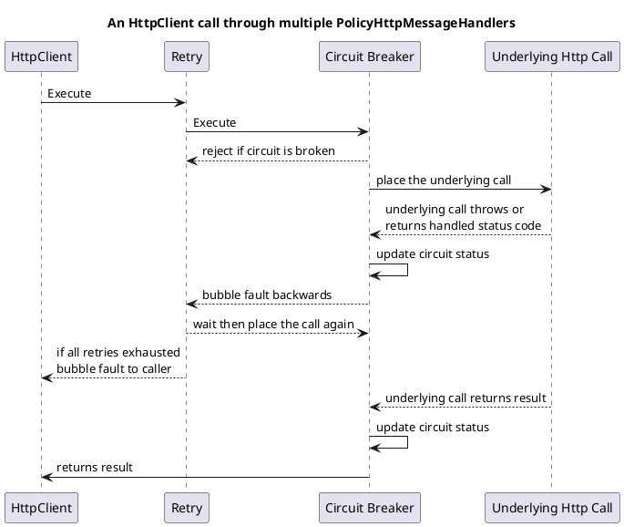

## Контекст

С ростом сложности распределенных систем, также и увеличивается число потенциальных точек отказа. Временные сбои (network glithces, timeout) - это не исключение а нормальная рабочая ситуация. Сбой одного сервиса потенциально может распространиться на другие сервисы по всему приложению. Например, если в вызывающем сервисе заняты дорогие ресурсы, такие как потоки, пока он ждёт ответа от другого сервиса, а отвечающий сервис демонстрирует такую высокую задержку, что становится практически непригодным. Это может привести к исчерпанию ресурсов, из‑за чего вызывающий сервис не сможет обрабатывать другие запросы.

## Проблема 

Как предотвратить каскадное распространение сетевого или сервисного сбоя на другие сервисы?

## Решение

Клиент сервиса должен вызывать удалённый сервис через прокси - circuit breaker. Когда количество последовательных ошибок превышает пороговое значение, «circuit breaker» срабатывает, и в течение заданного периода таймаута все попытки вызова удалённого сервиса немедленно завершаются с ошибкой. После истечения таймаута circuit breaker пропускает ограниченное число пробных запросов. Если эти запросы успешны, автомат возвращается в нормальный режим работы. В противном случае, при очередной ошибке, период таймаута начинается снова.

## Стратегии повышения отказоустойчивости

### Реактивные

Эти стратегии обрабатывают конкретные исключения, или результаты, которые возвращаются из колбэков, выполняемых через стратегию.

| Стратегия                                      | Предпосылки                                                                                                                                                                      | Смягчение последствий                                                                              |
| ---------------------------------------------- | -------------------------------------------------------------------------------------------------------------------------------------------------------------------------------- | -------------------------------------------------------------------------------------------------- |
| [**Retry** family](#Retry)                     | Многие ошибки носят временный характер и могут исчезнуть после короткой задержки.                                                                                                | Позволяет настраивать автоматические повторные попытки.                                            |
| [**Circuit-breaker** family](#circuit-breaker) | Когда система серьёзно перегружена, лучше быстро давать отказ, чем заставлять пользователей/вызователей ждать. Защита падающей системы от перегрузки помогает ей восстановиться. | Размыкает цепь (блокирует выполнения) на период, когда количество ошибок превышает заданный порог. |
| [**Fallback** family](#fallback)               | Сбой всё равно возможен — заранее спланируйте, что делать в этом случае.                                                                                                         | Определяет альтернативное значение для возврата (или действие для выполнения) при ошибке.          |
| [**Hedging (хеджирование)** family](#hedging)  | Иногда операции выполняются медленно — заранее спланируйте, что делать в таких случаях.                                                                                          | Запускает параллельные действия при задержках и ждёт результат самого быстрого из них.             |
### Проактивные

В отличие от реактивных стратегий, проактивные стратегии не сосредоточены на обработке ошибок, хотя колбэки всё ещё могут выбрасывать исключения или возвращать ошибки. Они могут принимать проактивные решения об отмене или отклонении выполнения колбэков.

| Стратегия                         | Предпосылка                                                                                                                                                                     | Предотвращение                                                         |
| --------------------------------- | ------------------------------------------------------------------------------------------------------------------------------------------------------------------------------- | ---------------------------------------------------------------------- |
| [**Timeout (таймаут)**](#timeout) | После определённого времени ожидания успех маловероятен.                                                                                                                        | Гарантирует, что вызывающий не будет ждать дольше заданного таймаута.  |
| [**Rate Limiter**](#Rate-Limiter) | Ограничение скорости обработки запросов — ещё один способ контролировать нагрузку. Это применимо как к приёму входящих вызовов вашей системы, так и к вызовам внешних сервисов. | Ограничивает выполнение так, чтобы оно не превышало заданную скорость. |

## Пример реализации стратегий с библиотекой Polly

### Quick Start

```cs
var services = new ServiceCollection();

// Define a resilience pipeline with the name "my-pipeline"
services.AddResiliencePipeline("my-pipeline", builder =>
{
    builder
        .AddRetry(new RetryStrategyOptions())
        .AddTimeout(TimeSpan.FromSeconds(10));
});

// Build the service provider
var serviceProvider = services.BuildServiceProvider();

// Retrieve a ResiliencePipelineProvider that dynamically creates and caches the resilience pipelines
var pipelineProvider = serviceProvider.GetRequiredService<ResiliencePipelineProvider<string>>();

// Retrieve your resilience pipeline using the name it was registered with
ResiliencePipeline pipeline = pipelineProvider.GetPipeline("my-pipeline");

// Alternatively, you can use keyed services to retrieve the resilience pipeline
pipeline = serviceProvider.GetRequiredKeyedService<ResiliencePipeline>("my-pipeline");

// Execute the pipeline
await pipeline.ExecuteAsync(static async token =>
{
    // Your custom logic goes here
});
```


### Retry

```cs
// Retry using the default options.
// See https://www.pollydocs.org/strategies/retry#defaults for defaults.
var optionsDefaults = new RetryStrategyOptions();

// For instant retries with no delay
var optionsNoDelay = new RetryStrategyOptions
{
    Delay = TimeSpan.Zero
};

// For advanced control over the retry behavior, including the number of attempts,
// delay between retries, and the types of exceptions to handle.
var optionsComplex = new RetryStrategyOptions
{
    ShouldHandle = new PredicateBuilder().Handle<SomeExceptionType>(),
    BackoffType = DelayBackoffType.Exponential,
    UseJitter = true,  // Adds a random factor to the delay
    MaxRetryAttempts = 4,
    Delay = TimeSpan.FromSeconds(3),
};

// To use a custom function to generate the delay for retries
var optionsDelayGenerator = new RetryStrategyOptions
{
    MaxRetryAttempts = 2,
    DelayGenerator = static args =>
    {
        var delay = args.AttemptNumber switch
        {
            0 => TimeSpan.Zero,
            1 => TimeSpan.FromSeconds(1),
            _ => TimeSpan.FromSeconds(5)
        };

        // This example uses a synchronous delay generator,
        // but the API also supports asynchronous implementations.
        return new ValueTask<TimeSpan?>(delay);
    }
};

// To extract the delay from the result object
var optionsExtractDelay = new RetryStrategyOptions<HttpResponseMessage>
{
    DelayGenerator = static args =>
    {
        if (args.Outcome.Result is HttpResponseMessage responseMessage &&
            TryGetDelay(responseMessage, out TimeSpan delay))
        {
            return new ValueTask<TimeSpan?>(delay);
        }

        // Returning null means the retry strategy will use its internal delay for this attempt.
        return new ValueTask<TimeSpan?>((TimeSpan?)null);
    }
};

// To get notifications when a retry is performed
var optionsOnRetry = new RetryStrategyOptions
{
    MaxRetryAttempts = 2,
    OnRetry = static args =>
    {
        Console.WriteLine("OnRetry, Attempt: {0}", args.AttemptNumber);

        // Event handlers can be asynchronous; here, we return an empty ValueTask.
        return default;
    }
};

// To keep retrying indefinitely or until success use int.MaxValue.
var optionsIndefiniteRetry = new RetryStrategyOptions
{
    MaxRetryAttempts = int.MaxValue,
};

// Add a retry strategy with a RetryStrategyOptions{<TResult>} instance to the pipeline
new ResiliencePipelineBuilder().AddRetry(optionsDefaults);
new ResiliencePipelineBuilder<HttpResponseMessage>().AddRetry(optionsExtractDelay);
```

If all retries fail, a retry strategy rethrows the final exception back to the calling code.
Если все повторные попытки были неудачными, то последнее выброшенное исключение возвращается вызывающему коду.

### Circuit-Breaker

```cs
// Circuit breaker with default options.
// See https://www.pollydocs.org/strategies/circuit-breaker#defaults for defaults.
var optionsDefaults = new CircuitBreakerStrategyOptions();

// Circuit breaker with customized options:
// The circuit will break if more than 50% of actions result in handled exceptions,
// within any 10-second sampling duration, and at least 8 actions are processed.
var optionsComplex = new CircuitBreakerStrategyOptions
{
    FailureRatio = 0.5,
    SamplingDuration = TimeSpan.FromSeconds(10),
    MinimumThroughput = 8,
    BreakDuration = TimeSpan.FromSeconds(30),
    ShouldHandle = new PredicateBuilder().Handle<SomeExceptionType>()
};

// Circuit breaker using BreakDurationGenerator:
// The break duration is dynamically determined based on the properties of BreakDurationGeneratorArguments.
var optionsBreakDurationGenerator = new CircuitBreakerStrategyOptions
{
    FailureRatio = 0.5,
    SamplingDuration = TimeSpan.FromSeconds(10),
    MinimumThroughput = 8,
    BreakDurationGenerator = static args => new ValueTask<TimeSpan>(TimeSpan.FromMinutes(args.FailureCount)),
};

// Handle specific failed results for HttpResponseMessage:
var optionsShouldHandle = new CircuitBreakerStrategyOptions<HttpResponseMessage>
{
    ShouldHandle = new PredicateBuilder<HttpResponseMessage>()
        .Handle<SomeExceptionType>()
        .HandleResult(response => response.StatusCode == HttpStatusCode.InternalServerError)
};

// Monitor the circuit state, useful for health reporting:
var stateProvider = new CircuitBreakerStateProvider();
var optionsStateProvider = new CircuitBreakerStrategyOptions<HttpResponseMessage>
{
    StateProvider = stateProvider
};

var circuitState = stateProvider.CircuitState;

/*
CircuitState.Closed - Normal operation; actions are executed.
CircuitState.Open - Circuit is open; actions are blocked.
CircuitState.HalfOpen - Recovery state after break duration expires; actions are permitted.
CircuitState.Isolated - Circuit is manually held open; actions are blocked.
*/

// Manually control the Circuit Breaker state:
var manualControl = new CircuitBreakerManualControl();
var optionsManualControl = new CircuitBreakerStrategyOptions
{
    ManualControl = manualControl
};

// Manually isolate a circuit, e.g., to isolate a downstream service.
await manualControl.IsolateAsync();

// Manually close the circuit to allow actions to be executed again.
await manualControl.CloseAsync();

// Add a circuit breaker strategy with a CircuitBreakerStrategyOptions{<TResult>} instance to the pipeline
new ResiliencePipelineBuilder().AddCircuitBreaker(optionsDefaults);
new ResiliencePipelineBuilder<HttpResponseMessage>().AddCircuitBreaker(optionsStateProvider);
```

### Fallback

```cs
// A fallback/substitute value if an operation fails.
var optionsSubstitute = new FallbackStrategyOptions<UserAvatar>
{
    ShouldHandle = new PredicateBuilder<UserAvatar>()
        .Handle<SomeExceptionType>()
        .HandleResult(r => r is null),
    FallbackAction = static args => Outcome.FromResultAsValueTask(UserAvatar.Blank)
};

// Use a dynamically generated value if an operation fails.
var optionsFallbackAction = new FallbackStrategyOptions<UserAvatar>
{
    ShouldHandle = new PredicateBuilder<UserAvatar>()
        .Handle<SomeExceptionType>()
        .HandleResult(r => r is null),
    FallbackAction = static args =>
    {
        var avatar = UserAvatar.GetRandomAvatar();
        return Outcome.FromResultAsValueTask(avatar);
    }
};

// Use a default or dynamically generated value, and execute an additional action if the fallback is triggered.
var optionsOnFallback = new FallbackStrategyOptions<UserAvatar>
{
    ShouldHandle = new PredicateBuilder<UserAvatar>()
        .Handle<SomeExceptionType>()
        .HandleResult(r => r is null),
    FallbackAction = static args =>
    {
        var avatar = UserAvatar.GetRandomAvatar();
        return Outcome.FromResultAsValueTask(UserAvatar.Blank);
    },
    OnFallback = static args =>
    {
        // Add extra logic to be executed when the fallback is triggered, such as logging.
        return default; // Returns an empty ValueTask
    }
};

// Add a fallback strategy with a FallbackStrategyOptions<TResult> instance to the pipeline
new ResiliencePipelineBuilder<UserAvatar>().AddFallback(optionsOnFallback);
```

### Hedging

```cs
// Hedging with default options.
// See https://www.pollydocs.org/strategies/hedging#defaults for defaults.
var optionsDefaults = new HedgingStrategyOptions<HttpResponseMessage>();

// A customized hedging strategy that retries up to 3 times if the execution
// takes longer than 1 second or if it fails due to an exception or returns an HTTP 500 Internal Server Error.
var optionsComplex = new HedgingStrategyOptions<HttpResponseMessage>
{
    ShouldHandle = new PredicateBuilder<HttpResponseMessage>()
        .Handle<SomeExceptionType>()
        .HandleResult(response => response.StatusCode == HttpStatusCode.InternalServerError),
    MaxHedgedAttempts = 3,
    Delay = TimeSpan.FromSeconds(1),
    ActionGenerator = static args =>
    {
        Console.WriteLine("Preparing to execute hedged action.");

        // Return a delegate function to invoke the original action with the action context.
        // Optionally, you can also create a completely new action to be executed.
        return () => args.Callback(args.ActionContext);
    }
};

// Subscribe to hedging events.
var optionsOnHedging = new HedgingStrategyOptions<HttpResponseMessage>
{
    OnHedging = static args =>
    {
        Console.WriteLine($"OnHedging: Attempt number {args.AttemptNumber}");
        return default;
    }
};

// Add a hedging strategy with a HedgingStrategyOptions<TResult> instance to the pipeline
new ResiliencePipelineBuilder<HttpResponseMessage>().AddHedging(optionsDefaults);
```

Если все хеджированные попытки были неудачными, то стратегия либо выбросит изначальное исключение, либо вернет объект изначальной ошибки. 

### Timeout

Стратегия Timeout предполагает, что выполняемые делегаты поддерживают кооперативную отмену (co-operative cancellation). Вы должны использовать перегрузки `Execute/Async(...)`, принимающие `CancellationToken`, и выполняемый делегат должен его принимать.

```cs
// To add a timeout with a custom TimeSpan duration
new ResiliencePipelineBuilder().AddTimeout(TimeSpan.FromSeconds(3));

// Timeout using the default options.
// See https://www.pollydocs.org/strategies/timeout#defaults for defaults.
var optionsDefaults = new TimeoutStrategyOptions();

// To add a timeout using a custom timeout generator function
var optionsTimeoutGenerator = new TimeoutStrategyOptions
{
    TimeoutGenerator = static args =>
    {
        // Note: the timeout generator supports asynchronous operations
        return new ValueTask<TimeSpan>(TimeSpan.FromSeconds(123));
    }
};

// To add a timeout and listen for timeout events
var optionsOnTimeout = new TimeoutStrategyOptions
{
    TimeoutGenerator = static args =>
    {
        // Note: the timeout generator supports asynchronous operations
        return new ValueTask<TimeSpan>(TimeSpan.FromSeconds(123));
    },
    OnTimeout = static args =>
    {
        Console.WriteLine($"{args.Context.OperationKey}: Execution timed out after {args.Timeout.TotalSeconds} seconds.");
        return default;
    }
};

// Add a timeout strategy with a TimeoutStrategyOptions instance to the pipeline
new ResiliencePipelineBuilder().AddTimeout(optionsDefaults);
```

Timeout стратегия выбрасывает `TimeoutRejectedException` когда достигается тайм-а.

### Rate-Limiter

```cs
// Add rate limiter with default options.
// See https://www.pollydocs.org/strategies/rate-limiter#defaults for defaults.
new ResiliencePipelineBuilder()
    .AddRateLimiter(new RateLimiterStrategyOptions());

// Create a rate limiter to allow a maximum of 100 concurrent executions and a queue of 50.
new ResiliencePipelineBuilder()
    .AddConcurrencyLimiter(100, 50);

// Create a rate limiter that allows 100 executions per minute.
new ResiliencePipelineBuilder()
    .AddRateLimiter(new SlidingWindowRateLimiter(
        new SlidingWindowRateLimiterOptions
        {
            PermitLimit = 100,
            SegmentsPerWindow = 4,
            Window = TimeSpan.FromMinutes(1)
        }));
```

## Использование Polly с HttpClientFactory 

### Quick Start
#### Шаг 1 Настройка клиента с политиками Polly

#### Определить типизированный `HttpClient` 

```cs
public void ConfigureServices(IServiceCollection services)
{
    // Configure a client named as "GitHub", with various default properties.
    services.AddHttpClient("GitHub", client =>
    {
        client.BaseAddress = new Uri("https://api.github.com/");
        client.DefaultRequestHeaders.Add("Accept", "application/vnd.github.v3+json");
    });

    // ...
}
```

#### Расширьте конфигурацию клиента политиками Polly

Чтобы применить политики Polly, просто расширьте приведённый выше пример с помощью fluent-конфигурации:

```cs
services.AddHttpClient("GitHub", client =>
{
    client.BaseAddress = new Uri("https://api.github.com/");
    client.DefaultRequestHeaders.Add("Accept", "application/vnd.github.v3+json");
})
.AddTransientHttpErrorPolicy(builder => builder.WaitAndRetryAsync(new[]
{
    TimeSpan.FromSeconds(1),
    TimeSpan.FromSeconds(5),
    TimeSpan.FromSeconds(10)
}));
```

В этом примере создаётся политика, которая будет обрабатывать типичные временные ошибки, повторяя исходный HTTP-запрос до 3 раз при необходимости. 
Политика задаёт задержку: 
1 секунда перед первой повторной попыткой; 
5 секунд перед второй; 
10 секунд перед третьей.

Перегрузка `.AddTransientHttpErrorPolicy(...)` — одна из нескольких доступных опций.

#### Шаг 2. Используйте настроенный HttpClient

Для полноты картины — пример использования настроенного `HttpClient`. Для именованного клиента (как в примере выше) получите `IHttpClientFactory` через dependency injection в месте использования. Затем используйте эту фабрику, чтобы получить `HttpClient`, настроенный так, как вы определили в `Startup`:

```cs
public class MyController : Controller
{
    private readonly IHttpClientFactory _httpClientFactory;

    public MyController(IHttpClientFactory httpClientFactory)
    {
        _httpClientFactory = httpClientFactory;
    }

    public Task<IActionResult> SomeAction()
    {
        // Get an HttpClient configured to the specification you defined in StartUp.
        var client = _httpClientFactory.CreateClient("GitHub");

        return Ok(await client.GetStringAsync("/someapi"));
    }
}
```

Вызов `await client.GetStringAsync("/someapi")` применяет настроенные политики _внутри всего вызова_.


## Настройка политик Polly

### Использование `.AddTransientHttpErrorPolicy(...)`

Давайте снова посмотрим на пример из Шага 2 выше:

```csharp
services.AddHttpClient("GitHub", client =>
{
    client.BaseAddress = new Uri("https://api.github.com/");
    client.DefaultRequestHeaders.Add("Accept", "application/vnd.github.v3+json");
})
.AddTransientHttpErrorPolicy(builder => builder.WaitAndRetryAsync(new[]
{
    TimeSpan.FromSeconds(1),
    TimeSpan.FromSeconds(5),
    TimeSpan.FromSeconds(10)
}));
```

В условии `builder => builder` вы можете выбрать любую реактивную политику из предложений Polly: стратегию [повтора](#Retry) (как в примере выше), политику [circuit-breaker](#circuit-breaker)) или политику отката [fallback](#fallback).

Выбор в `.AddTransientHttpErrorPolicy(...)` обрабатывать `HttpRequestException`, HTTP 5xx, HTTP 408 — это удобная опция, но не обязательная. Если этот фильтр ошибок вам не подходит — вы можете расширить определение обрабатываемых ошибок или построить полностью собственную политику Polly.

### Использование любой политики, настроенной через традиционный синтаксис Polly

Также доступны перегрузки, принимающие любой `IAsyncPolicy<HttpResponseMessage>`, так что вы можете определить и применить любой тип политики: вы указываете и *то, что* обрабатывать, и *то, как* обрабатывать.

Этот пример демонстрирует использование `.AddPolicyHandler(...)` для добавления политики, где мы закодировали нашу собственную спецификацию обрабатываемых сбоев:

```csharp
var retryPolicy = Policy.Handle<HttpRequestException>()
    .OrResult<HttpResponseMessage>(response => MyCustomResponsePredicate(response))
    .WaitAndRetryAsync(new[]
    {
        TimeSpan.FromSeconds(1),
        TimeSpan.FromSeconds(5),
        TimeSpan.FromSeconds(10)
    }));

services.AddHttpClient(/* и т.д. */)
    .AddPolicyHandler(retryPolicy);
```

Помимо [**реактивных** политик](#Реактивные) Polly, эти перегрузки означают, что вы также можете использовать [**проактивные** политики](#Проактивные), такие как таймаут:

```csharp
var timeoutPolicy = Policy.TimeoutAsync<HttpResponseMessage>(10);

services.AddHttpClient(/* и т.д. */)
    .AddPolicyHandler(timeoutPolicy);
```

Все вызовы через `HttpClient` возвращают `HttpResponseMessage`, поэтому настраиваемые политики должны быть типа `IAsyncPolicy<HttpResponseMessage>`. Необобщённые политики `IAsyncPolicy` также могут быть преобразованы в `IAsyncPolicy<HttpResponseMessage>` с помощью простого удобного метода:

```csharp
var timeoutPolicy = Policy.TimeoutAsync(10);

services.AddHttpClient(/* и т.д. */)
    .AddPolicyHandler(timeoutPolicy.AsAsyncPolicy<HttpResponseMessage>());
```

### Расширение удобного определения `.AddTransientHttpErrorPolicy(...)`

Определение ошибок, обрабатываемых `.AddTransientHttpErrorPolicy(...)`, также доступно из пакета расширений Polly, Polly.Extensions.Http.

Их использование позволяет взять базовую спецификацию обрабатываемых ошибок и расширить её. Например, политика, настроенная ниже, дополнительно будет обрабатывать статус-код 429:

```csharp
using Polly.Extensions.Http; // После установки nuget-пакета: Polly.Extensions.Http

// ..

var policy = HttpPolicyExtensions
  .HandleTransientHttpError() // HttpRequestException, 5XX и 408
  .OrResult(response => (int)response.StatusCode == 429) // RetryAfter
  .WaitAndRetryAsync(/* и т.д. */);
```

### Применение нескольких политик

Все перегрузки для настройки политик также могут быть объединены в цепочку для применения нескольких политик:

```csharp
services.AddHttpClient(/* и т.д. */)
    .AddTransientHttpErrorPolicy(builder => builder.WaitAndRetryAsync(new[]
    {
        TimeSpan.FromSeconds(1),
        TimeSpan.FromSeconds(5),
        TimeSpan.FromSeconds(10)
    }))
    .AddTransientHttpErrorPolicy(builder => builder.CircuitBreakerAsync(
        handledEventsAllowedBeforeBreaking: 3,
        durationOfBreak: TimeSpan.FromSeconds(30)
    ));
```

#### В каком порядке применяются несколько политик?

Когда вы настраиваете несколько политик (как в примере выше), политики применяются к каждому вызову в порядке от внешней (настроенной первой) к внутренней (настроенной последней).

В приведенном выше примере вызов будет:

1. Сначала пропущен через (внешнюю) политику повтора, которая, в свою очередь:
2. пропустит вызов через (внутренний) размыкатель цепи, который, в свою очередь:
3. выполнит базовый HTTP-вызов.



Последовательность политик в этом примере была выбрана потому, что circuit-breaker может изменить состояние в один из тех периодов (1, 5 или 10 секунд), когда политика повтора ожидает между попытками. Размыкатель цепи настроен «внутри» повтора, так что состояние цепи проверяется снова как часть действия при выполнении повторной попытки.

В приведенном выше примере применяются две политики (повтор и размыкатель цепи), но возможно любое количество. Полезной комбинацией может быть применение повтора, размыкателя цепи и таймаута на одну попытку (см. ниже).